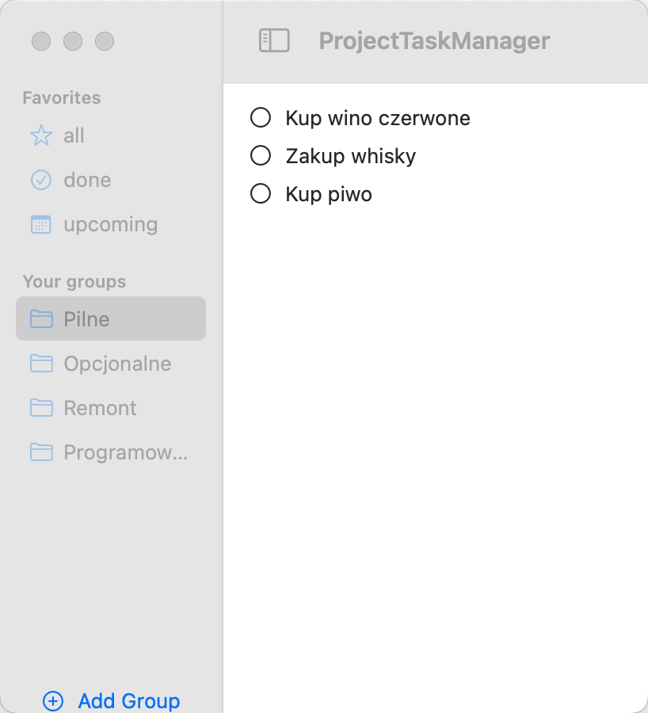
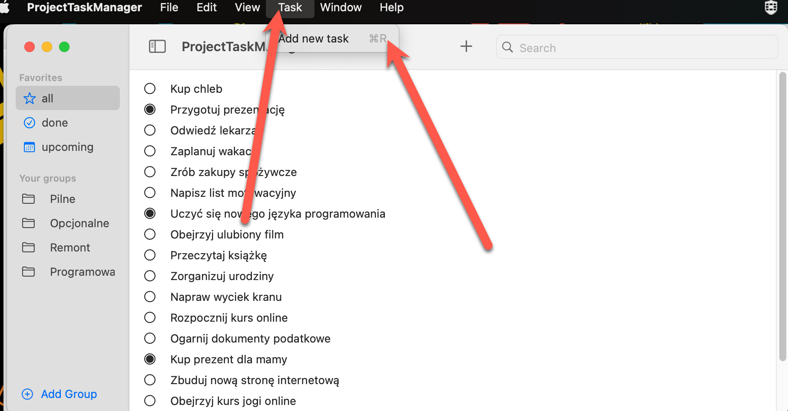
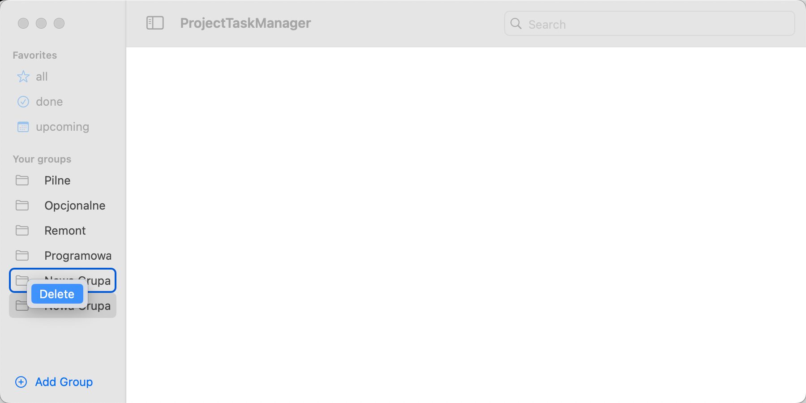

# Task project Manager


## Wstęp

Chcesz stworzyć aplikację na platformę Mac, ale nie wiesz, od czego zacząć? Bardzo lubię macOS. Osobiście zaczynałem od tworzenia aplikacji na iOS, ale ostatnio bardzo zainteresowałem się tworzeniem aplikacji na macOS, szczególnie od czasu, gdy SwiftUI sprawiło, że stało się to bardzo dostępne dla większości osób. Jeśli już znasz SwiftUI, to przechodzenie na platformę macOS będzie dość łatwe, o ile znasz kilka sztuczek, które dzisiaj ci pokażę. Jeśli nigdy nie zajmowałeś się żadnym rodzajem rozwoju na platformie Apple, zalecam, abyś najpierw zainstalował Xcode. Jest to oprogramowanie, środowisko programistyczne, którego potrzebujesz do tworzenia aplikacji na macOS. Podlinkuję film, w którym możesz znaleźć informacje o tym, jak pobrać Xcode. Musisz nauczyć się języka Swift, który jest używany do programowania aplikacji na platformę Apple. Istnieje również wiele materiałów na temat Objective-C, starszej wersji języka, szczególnie jeśli chcesz zagłębić się i dokładnie dostosować swoje aplikacje za pomocą AppKit. Jednak dla początkujących nie poleciłbym tego. Nauka i tworzenie aplikacji w Objective-C wymaga znacznie więcej czasu. Więc po zainstalowaniu Xcode i opanowaniu podstaw Swifta możesz nauczyć się SwiftUI. W ramach tego samouczka będę zakładać, że znasz już podstawy SwiftUI. Na koniec tego samouczka będziemy mieli gotowy projekt demonstracyjny, którym będzie menedżer zadań. macOS ma wiele aplikacji, które możesz stworzyć jako natywne aplikacje na tę platformę. Większość z nich ma coś wspólnego z produktywnością. Na przykład w tym samouczku tworzę menedżer zadań. W tej chwili chciałbym skupić się na konfiguracji danych i tworzeniu widoków, ponieważ chcę bardziej skoncentrować się na specyfikach macOS, aby dać ci pojęcie, co jest możliwe, i abyś miał kilka pomysłów, gdzie szukać informacji.


Teraz, jeśli chodzi o macOS, zazwyczaj masz pasek boczny z widokiem szczegółowym lub kilkoma kolumnami. W tym przypadku jest to specyficzny widok, który nazywa się nawigacyjnym podziałem widoku, który będziemy używać.

.gif)


 Dodałem tu trzy grupy: "Wszystkie", "Zrobione zadania" i "Zadania nadchodzące". Dodatkowo, jako test, dodałem możliwość dodawania list lub grup, ponieważ wiąże się to z trochę bardziej zaawansowaną obsługą danych. Postaram się to bardzo uprościć. W sekcji "Wszystkie" będziesz mógł oznaczać zadania jako wykonane lub odznaczać je. Możesz również je tutaj edytować. Kilka bardziej specyficznych rzeczy związanych z macOS to na przykład skróty klawiszowe. Dodałem tutaj jeden dla opcji "Nowa lista". Jeśli naciśniesz Command + A, zobaczysz, że dodaję nową listę. Po prostu coś dodałem. Coś takiego jak prawy przycisk myszy do usuwania, kopiowania lub zmiany nazwy akcji. Jest to bardzo podobne do menu rozwijanego lub okienka kontekstowego. W przypadku macOS wiele opcji jest dostępnych na pasku narzędzi. Tutaj dodałem przycisk plus do tworzenia nowego zadania. Jest także pasek wyszukiwania, dzięki któremu możesz wyszukiwać zadania zawierające słowo "crazy". Następnie możesz go zamknąć i zobaczyć wszystkie zadania ponownie. Istnieje wiele zaawansowanych funkcji wyszukiwania, których nie będę omawiał w tym samouczku. W opisie zamieszczę wiele innych samouczków, bo nie chcę przytłaczać cię wszystkimi funkcjami od razu, ale dostajesz ogólne pojęcie, gdzie co dodać i na co zwrócić uwagę. Inne rzeczy, które mogą cię zainteresować, to na przykład dodawanie menu. W tym przypadku dodałem nowe menu dla zadań, ale nie podłączyłem przycisku do niego. To trochę trudniejsze w SwiftUI, ale dodali pewne nowe funkcje, które teraz umożliwiają to w miarę łatwo. Dodałem tutaj także drugi typ okna z przykładowym tekstem.

Możesz również używać prawego przycisku myszy, aby otworzyć nowe okno. W macOS 13 wprowadzono wiele ulepszeń, dzięki czemu programistyczne otwieranie nowego okna jest dość proste. Co więcej, każda aplikacja na Macu powinna mieć okno ustawień. To jest to, gdy idziesz pod swoje imię, w ustawieniach otwierasz to. Nie podłączyłem jeszcze niczego. Jedną rzeczą, którą możesz chcieć podłączyć, jest możliwość dodania paska menu. Tutaj dodałem bardzo prosty. Bardziej interesujące jest na przykład to, co widzisz w jednym z menedżerów zadań, które pobrałem, np. "Tick Tick". Masz tutaj wszystkie ostatnie zadania bezpośrednio dostępne, co jest bardzo przydatne. Inne rzeczy, które mogą cię zainteresować, to na przykład dodawanie widżetów. Nie zapisuję żadnych danych, więc to są naprawdę tylko dane testowe, ale w przyszłym filmie dodam trwałe dane i będziemy używać Core Data. To jest przydatne zwłaszcza w przypadku zaawansowanego wyszukiwania, jeśli chcesz dodawać tagi, filtrować według daty itp. Łatwo to zrobić z Core Data. Dodatkowo, jeśli używasz Core Data w połączeniu z synchronizacją iCloud, możesz pozwolić użytkownikom synchronizować dane między różnymi urządzeniami. O ile pozostaniesz w ekosystemie Apple, wielu użytkowników prawdopodobnie korzysta z jednego lub drugiego urządzenia. Nie wiem, czy jest wielu użytkowników Androida i Maca, ponieważ stworzyli połączony ekosystem. Teraz, gdy masz pojęcie o tym, jaką aplikację na macOS zamierzasz stworzyć, przejdźmy do kodowania i stworzenia nowego projektu. Użyję tu szablonu projektu macOS do aplikacji. Jeśli wiesz, że chcesz także mieć aplikację towarzyszącą na iOS lub iPadOS, możesz wybrać opcję "Wieloplatformowy". Jest to również bardzo dobry pomysł, jeśli chcesz później dodać subskrypcje uniwersalne, ponieważ wtedy możesz mieć subskrypcję współdzieloną między iOS a macOS. Ja wybiorę macOS, żeby było trochę łatwiej. Nazwę to "Task Manager". Interfejs to SwiftUI, język to Swift. Nie używam żadnego przechowywania.


Teraz, jeśli chcesz uruchomić to na Macu, musisz mieć połączone konto deweloperskie. Przechodząc do aplikacji, docelowy menedżer zadań, w sekcji "Zaloguj się i zdolności" musisz mieć zespół używany, inaczej nie będziesz mógł budować na macOS, ale może to być bezpłatne konto deweloperskie. Po prostu je utwórz, jeśli jeszcze go nie masz. Teraz zacznijmy tworzyć nieco danych do wyświetlenia. Najpierw tworzymy widoki, a potem połączymy je w aplikacji. Bardziej specyficzne dla macOS rzeczy zobaczymy trochę później. Jeśli nie chcesz przechodzić przez fazę konfiguracji modeli, możesz po prostu przejść do linku w opisie i pobrać projekt. Dobra, więc utworzę nową grupę dla modelu, a dwa pliki modelu, które muszę utworzyć, aby obsłużyć moje dane, to jeden typ dla samego zadania. 


```swift
struct Task: Identifiable {
    internal init(title: String, isCompleted: Bool = false, dueDate: Date = Date(), details: String? = nil) {
        self.title = title
        self.isCompleted = isCompleted
        self.dueDate = dueDate
        self.details = details
    }


    let id = UUID()
    var title: String
    var isCompleted: Bool
    var dueDate: Date
    var details: String?
}
```


To jest struktura zgodna z Identifiable, co oznacza, że muszę mieć ID. Wartość ID to UUID. Następnie muszę mieć tytuł, więc co pokazujemy, co mamy do zrobienia? To jest łańcuch znaków, i powinienem to zmienić na zmienną, ponieważ użytkownik może chcieć zmienić tytuł. Potem zmienna isCompleted, to typ bool. Potem mamy termin wykonania, date, do kiedy musimy ukończyć nasze zadanie, typu date. Możesz również dodać więcej informacji o tym zadaniu, na przykład opis szczegółowy, który jest łańcuchem znaków, a może nawet opcjonalny. Następnie stworzę funkcję init wkorzystując do tego jedna z opcji  Xcode:


Już stworzyłem tutaj domyślną wartość nil dla szczegółów. A flaga isCompleted, chcę mieć domyślnie ustawioną na false, bo przypuszczam, że jeśli tworzysz nowe zadanie, to nie jest ukończone. Aby pracować z podglądami w SwiftUI, stworzę pewne statyczne dane tylko do pokazania w naszej aplikacji. Są to statyczne funkcje. Jedna z nich to na przykład ta, w której tworzymy tylko jedną instancję zadania. Tytuł to "Kup mleko". Następnie termin wykonania, pokażę ci krótko, jak używać obiektu kalendarza. Jeśli chcesz utworzyć datę w przyszłości, a nie tylko datę bieżącą. Używam tu funkcji "date(byAdding:to:)", a jako argumenty podaję .day oraz datę bieżącą. Otrzymujemy datę, która jest dwa dni w przyszłości.


```swift
    static func example() -> Task {
        Task(title: "Kup flaszkę",  dueDate: Calendar.current.date(byAdding: .day, value: 2, to: Date())!, details: "Najchętniej Taliskera")
    }
```

Następnie utworzę przykładową statyczną funkcję, która utworzy dla mnie tablicę zadań. Przyda się do listy, aby coś wyświetlić. Ja namówiłem chat gpt zeby mi przygotował taką liste zadań:

```swift
static func examples() -> [Task] {
    return [
        Task(title: "Kup chleb", details: "A jak będą to jajka, to tuzin"),
        Task(title: "Przygotuj prezentację", dueDate: Calendar.current.date(byAdding: .day, value: 3, to: Date())!, details: "Dla spotkania zespołu"),
        Task(title: "Odwiedź lekarza", dueDate: Calendar.current.date(byAdding: .day, value: 7, to: Date())!, details: "Badanie ogólne"),
        Task(title: "Zaplanuj wakacje", dueDate: Calendar.current.date(byAdding: .month, value: 2, to: Date())!, details: "Trasa i zakwaterowanie"),
        Task(title: "Zrób zakupy spożywcze"),
        Task(title: "Napisz list motywacyjny", dueDate: Calendar.current.date(byAdding: .day, value: 5, to: Date())!, details: "Podanie o pracę"),
        Task(title: "Uczyć się nowego języka programowania", details: "Najlepiej PHP, przyda sie w robocie"),
        Task(title: "Obejrzyj ulubiony film", details: "Wieczór filmowy z przyjaciółmi"),
        Task(title: "Przeczytaj książkę", details: "Dokładnie 50 stron dziennie"),
        Task(title: "Zorganizuj urodziny", dueDate: Calendar.current.date(byAdding: .month, value: 1, to: Date())!, details: "Lista gości i menu"),
        Task(title: "Napraw wyciek kranu"),
        Task(title: "Rozpocznij kurs online", dueDate: Calendar.current.date(byAdding: .day, value: 10, to: Date())!, details: "Programowanie w Swift"),
        Task(title: "Ogarnij dokumenty podatkowe", dueDate: Calendar.current.date(byAdding: .month, value: 3, to: Date())!, details: "Dla księgowego"),
        Task(title: "Kup prezent dla mamy", dueDate: Calendar.current.date(byAdding: .day, value: 14, to: Date())!, details: "Na urodziny"),
        Task(title: "Zbuduj nową stronę internetową", details: "Projekt portfolio"),
        Task(title: "Obejrzyj kurs jogi online"),
        Task(title: "Zacznij bieganie", details: "3 razy w tygodniu"),
        Task(title: "Zorganizuj piknik", dueDate: Calendar.current.date(byAdding: .month, value: 2, to: Date())!, details: "Na świeżym powietrzu"),
        Task(title: "Przetestuj nową aplikację", dueDate: Calendar.current.date(byAdding: .day, value: 2, to: Date())!, details: "Feedback dla deweloperów")
    ]
}
```

 To jest pierwszy plik modelu, a następnie tworzę drugi dla grupy zadań. 


```swift
struct TaskGroup:Identifiable {
    internal init(title: String, creationDate: Date, tasks: [Task] = []) {
        self.title = title
        self.creationDate = creationDate
        self.tasks = tasks
    }

    let id = UUID()
    var title:String
    let creationDate: Date
    var tasks: [Task]
    
}
```

Znowu struktura dla grupy zadań, gdzie ID jest UUID, a także tytuł typu string. Możesz również dodać na przykład datę utworzenia, co jest bardziej interesujące dla sortowania, więc może nie musiałbym tego używać tutaj. Tytuł powinien być zmienną. Główną rzeczą jest to, że grupa zadań jest powiązana z niektórymi zadaniami. Ma właściwość `tasks` typu tablica zadań. Napiszmy init, a data utworzenia to bieżąca data. Tak naprawdę nie chcę tego przekazywać tutaj. Po prostu ustawiam to w inicializatorze i dodaję również domyślną wartość pustej tablicy dla zadań. Dobra, teraz zróbmy to samo i stworzymy statyczne funkcje do utworzenia przykładowej instancji mojej grupy zadań, a potem drugą dla przykładów, która jest tablicą grup zadań. (podpowiem chat gpt tez sie dobzre sprawdzi ;)


```swift
    static func example() ->  TaskGroup {

        let task1 =  Task(title: "Kup wino czerwone", details: "Ulubione wino do kolacji")
        let task2 =  Task(title: "Zakup whisky", details: "Single malt Scotch")
        let task3 =  Task(title: "Kup piwo", details: "Craft beer z lokalnej browarni, mocno chmielone!")

        var group = TaskGroup(title: "Zakupy pierwszej potrzeby")
        group.tasks = [task1,task2,task3]
        return group
    }

    static func examples() -> [TaskGroup] {
        let group1 = TaskGroup.example()
        let group2 = TaskGroup(title: "Zakupy opcjonalne",  tasks: [
            Task(title: "Kup pieluchy", details: "Rozmiar 2, paczka 100 sztuk"),
            Task(title: "Zakup mleko modyfikowane", details: "Dla niemowląt"),
        ])
        let group3 = TaskGroup(title: "Projekt domowy",  tasks: [
            Task(title: "Zaprojektuj kuchnię", details: "Nowa zabudowa meblowa"),
            Task(title: "Kup materiały budowlane", details: "Farba, płytki, narzędzia"),
        ])
        let group4 = TaskGroup(title: "Programowanie",  tasks: [
            Task(title: "Napisz kod źródłowy", details: "Implementacja nowego funkcjonalności"),
            Task(title: "Zaktualizuj dokumentację", details: "Opis nowych zmian"),
            Task(title: "Testowanie oprogramowania", details: "Sprawdzenie poprawności działania"),
            Task(title: "Rozwiązywanie błędów", details: "Debugowanie aplikacji"),
            Task(title: "Spotkanie z zespołem", details: "Omówienie postępu prac"),
        ])
        return [group1, group2, group3, group4]
    }

```


### Teraz przechodzimy do interfejsu


I ostatnia rzecz, którą właściwie chciałem zrobić, to w moim pasku bocznym mam różne sekcje, które chcę, aby użytkownik mógł wybrać, i do tego używam enuma. Więc tworzę nowy plik Swift, plik enum task selection, enum task selection to znowu jest struktura Identifiable, więc mam trzy przypadki: `all`, `done` i `upcoming`, a także przypadek z konkretną listą. 

```swift
enum TaskSection: Identifiable,CaseIterable,Hashable {
    case all
    case done
    case upcoming
    case list(TaskGroup)
}
```


Teraz Xcode narzeka na brak identyfikatora ID. Robimy funkcje ktora zwracaj string. Tak więc `switch self`, `all`, `done`, `upcoming`, a w ostatnim przypadku użyłem UUID jako string. 

```swift
    var id: String {
        switch self {

        case .all:
            "all"
        case .done:
            "done"
        case .upcoming:
            "upcoming"
        case .list(let taskGroup):
            taskGroup.id.uuidString

        }
    }
```

Następnie potrzebuję mieć jakieś nazwy wyświetlane na pasku bocznym. Zmienna `display name` typu string, ponownie `switch self`, więc mam tutaj `all`, `done`, `upcoming`, a w tym przypadku używam tytułu grupy zadań. 

```swift
    var displayName: String {
        switch self {

        case .all:
            "all"
        case .done:
            "done"
        case .upcoming:
            "upcoming"
        case .list(let taskGroup):
            taskGroup.title
        }
    }
```

Następnie muszę mieć ikony, więc jest to `icon name` typu string. W tym przypadku pokazuję gwiazdkę dla wszystkich, znacznik zaznaczony dla zrobionych, ikonę kalendarza dla zbliżających się i dla listy to jest folder. Znowu muszę coś dodać tutaj, na przykład. Chcę, żeby ten przypadek był możliwy do iterowania. To znowu trochę skomplikowane ze względu na zadania. Przesuwam to niżej. Statyczna var `all cases`, i w tym przypadku zwracam po prostu `all`, `done` i `upcoming`. Ostatnie zmiany, jakie muszę wprowadzić, to dodanie protokołu `Hashable`. Dodaję protokół tutaj, więc lewa strona ID powinna być równa prawej stronie ID. Jeśli porównuję dwie selekcje zadań, są równe, gdy ID jest takie samo. Być może warto także przenieść to niżej. I nadal mamy jakiś błąd. Po prostu sprawmy, że `task group` także będzie `Hashable`, a `task` także będzie `Hashable`. Teraz jest już ok. 

Całość na koniec wygląda tak : 

```swift
enum TaskSection: Identifiable,CaseIterable,Hashable {


    case all
    case done
    case upcoming
    case list(TaskGroup)

    var id: String {
        switch self {

        case .all:
            "all"
        case .done:
            "done"
        case .upcoming:
            "upcoming"
        case .list(let taskGroup):
            taskGroup.id.uuidString

        }
    }
    var displayName: String {
        switch self {

        case .all:
            "all"
        case .done:
            "done"
        case .upcoming:
            "upcoming"
        case .list(let taskGroup):
            taskGroup.title
        }
    }
    var iconName: String {
        switch self {

        case .all:
            "star"
        case .done:
            "checkmark.circle"
        case .upcoming:
            "calendar"
        case .list(_):
            "folder"
        }
    }

    static var allCases: [TaskSection] {
        [.all,.done,.upcoming]
    }

    static func == (lhs: TaskSection, rhs: TaskSection) -> Bool {
        lhs.id == rhs.id
    }
}
```


Teraz mogę zająć się bardziej interesującymi rzeczami i pracować nad widokami. Chcę, aby był widok bocznego paska. To jest w tym przypadku widok `NavigationView`. `SidebarView`. A potem w głównym kontencie jest to `TaskListView`. Najpierw zaczniemy od widoku listy zadań. 

```swift
struct TaskListView: View {

    let title: String
    let tasks: [Task]
    var body: some View {
        List(tasks){ task in
            HStack{
                Image(systemName: task.isCompleted ? "largecircle.fill.circle" : "circle")
                Text(task.title)
            }
        }
    }
}

struct TaskListView_Previews: PreviewProvider {
    static var previews: some View {
        TaskListView(title: "Zadanka", tasks: Task.examples())
    }
}
```


Główną rzeczą, którą chcę tutaj pokazać, to zadania, więc muszę mieć tablicę moich danych. `let tasks` to tablica zadań. I także tytuł, łańcuch znaków. Teraz w moim podglądzie, na przykład, chcę pokazać wszystko. Teraz używam przykładów zadań. To jest ta tablica. Główną treścią jest lista zadan, `Task in`. Więc tutaj pokazałbym tekst z tytułem zadania. To są domyślne wartości, które utworzyłem. Oprócz tekstu chcę także pokazać ikonę, jeśli to jest zrobione zadanie lub nie. `Image(systemName:)`. Spójrzmy na bibliotekę Xcode i ikony, to jest ikona koła. Mogę użyć `.circle.fill`, `.circle`. Teraz mamy dwie różne ikony tutaj. Dobra, zostawmy to na razie, a będziemy dodawać interaktywne modyfikacje później, gdzie użytkownik może zmieniać tekst i flagę logiczną, czy jest ukończone, czy nie. 


Przejdźmy do widoku bocznego, więc znowu zaczynam od listy.

```swift
struct SidebarView: View {
    let userCreatedGroups: [TaskGroup]
    @State private var selection = TaskSection.all

    var body: some View {
        List(selection: $selection) {
            Section("Favorites") {
                ForEach(TaskSection.allCases) {
                    selection in
                    Label(selection.displayName, systemImage: selection.iconName)
                        .tag(selection)
                }
            }
            Section("Your groups") {
                ForEach(userCreatedGroups) { group in
                    Label(group.title, systemImage: "folder")
                        .tag(TaskSection.list(group))
                }
            }
        }
    }
}

struct SidebarView_Previews: PreviewProvider {
    static var previews: some View {
        SidebarView(userCreatedGroups: TaskGroup.examples())
    }
}
```

 Jedna rzecz, którą zdecydowanie chcę pokazać, to selekcja zadań. `All cases`. `Selection in`. Używam etykiety, ponieważ już dodałem informacje o nazwie wyświetlanej w selekcji i nazwie ikony w selekcji. Teraz mamy tu trzy ikony. Jeśli chcesz zobaczyć to bardziej w stylu bocznego paska, możesz w podglądzie dodać pasek boczny. Gdy połączymy to razem w podziale nawigacyjnym, zostanie to automatycznie zastosowane. Kolejną rzeczą, którą chcę tu faktycznie pokazać, są grupy utworzone przez użytkownika. Dlatego grupy utworzone przez użytkownika to tablica grup zadań. Dodaj to w podglądzie, taskGroup.examples, więc to jest tablica. Ponieważ teraz mam tutaj inne dane dla każdej grupy zadań utworzonych przez użytkownika. Grupa w. I użyjmy również etykiety z tytułem, który jest tytułem grupy. A nazwa systemu to folder. Teraz wszystko jest wyświetlane razem w jednym zestawieniu. Jeśli chcesz mieć sekcje z tytułem, to jest na przykład ulubione. Używam "forEach" jako zawartość każdej z sekcji. A potem kolejna sekcja dla grup utworzonych przez użytkownika, twoje grupy. Następną rzeczą, którą chcę teraz zrobić, to wybrać coś tutaj. Lista ma właściwość "selection", i muszę mieć stanową właściwość do tego. Stanową prywatną zmienną wybór, na przykład taskSelection. Możesz zacząć od przypadku "all cases". Następnie używam właściwości "selection" z wiązaniem, teraz tutaj do mojego wyboru. To nie działa, ponieważ czasami nie rozpoznaje wyboru, więc muszę dodać tutaj znacznik z wyborem. Teraz możesz coś wybrać. Muszę to również zrobić w przypadku drugiej sekcji. Więc to jest znacznik z wyborem "taskSelection". Używam tutaj typu listy i używam tej grupy. Prawdopodobnie nie powinienem pozwolić na zamianę grup. Teraz to jest ok, możemy coś wybrać tutaj, i chcę teraz połączyć wszystko w widoku zawartości z nawigacyjnym podziałem na panel boczny i szczegóły. Tak więc panel boczny to widok panelu bocznego, a szczegóły to widok listy zadań. Jak widzisz, muszę mieć tutaj pewne dane, które pokazuję. Chcę utworzyć kolejną właściwość tutaj dla tych grup utworzonych przez użytkownika. Stanowa prywatna zmienna userCreated i ponownie używam tutaj moich danych testowych. Następnie w widoku listy zadań muszę zmienić to, co tutaj pokazuję, w zależności od tego, co faktycznie wybrałem w widoku panelu bocznego. Aby to wiedzieć, muszę właściwie przekazać tę informację o jeden poziom wyżej, co oznacza, że nie może to być tutaj stanem. Muszę zmienić to wiązanie.Więc staje się to wiązaniem var selection typu task selection. Zmieniając to w podglądzie. Stałe "all". Wracając do widoku zawartości. Teraz tutaj wklejam moje wiązanie wyboru, które dostaję tutaj. Więc wiązanie do wyboru.

```swift
struct ContentView: View {

    @State private var selection = TaskSection.all
    @State private var allTasks = Task.examples()
    @State private var userCreatedGroups = TaskGroup.examples()
    
    var body: some View {
        NavigationSplitView{
            SidebarView(userCreatedGroups: userCreatedGroups,selection: $selection)
        } detail: {
            switch selection {
            case .all:
                TaskListView(title: "All", tasks: allTasks)
            case .done:
                TaskListView(title:"Done", tasks: allTasks.filter({ $0.isCompleted }))
            case .upcoming:
                TaskListView(title: "Upcoming", tasks: allTasks.filter({$0.isCompleted == false }))

            case .list(let taskGroup):

                TaskListView(title: taskGroup.title, tasks: taskGroup.tasks)
            }
        }
    }
}

struct ContentView_Previews: PreviewProvider {
    static var previews: some View {
        ContentView()
    }
}

```

Teraz, co do szczegółów. To zależy od tego, co wybrałem tutaj. Używam instrukcji wyboru switch. Jeśli mam listę, mogę jej użyć i użyć tytułu grupy zadań i zadań grupy zadań. Teraz muszę pokazać ci coś dla wszystkich, zrobionych i nadchodzących. Nie chcę robić tego zbyt skomplikowanego, więc tymczasowo zamierzam oszukać system i po prostu pokazać trochę danych testowych. W dalszej rozbudowe projektu bedziemy te dane pobierali z bazy danych. Więc definiujemy : `@state private var allTasks`, a to moja tablica przykładowych zadań. Widok listy zadań dla wszystkich, pokazując wszystkie zadania. W przypadku dwóch pozostałych przypadków zamierzam to przefiltrować. To naprawdę tylko dla naszego projektu demonstracyjnego. Nie chcę tego zbyt komplikować, więc tutaj filtruję to, mówiąc, że tylko jeśli zadanie jest zakończone, a w przypadku nadchodzących również to filtrowanie, ale mówiąc, że nie jest zakończone. Przetestujmy to. W przypadku "all" widzę wszystko zrobione. Widzę te zrobione, ponieważ mają kropkę , a nadchodzące to te, które nie są zakończone . Następnie przechodząc do "personal" jest ta, którą stworzyłem, a pozostałe nie mają żadnych. Więc to wygląda na jakieś działające. Już coś widać w naszym programie. 


-3655983.gif)


### Dodawanie grup zadań


Teraz dodajmy trochę więcej interakcji. Pierwsza z nich to tutaj w moim panelu bocznym chcę dodać przycisk, dodowania grup zadań.. Co oznacza, że w moim widoku listy panelu bocznego muszę to dodać na dole. Jeśli dodasz to do listy, pojawi się na końcu listy, ale jeśli dodasz więcej grup, tak jak chce użytkownik, chcę się upewnić, że użytkownik zawsze je widzi i nie tylko wtedy, gdy przewijają. Więc nie dodaję tego do listy, używam sztuczki, żeby użyć wcięć w obszarze bezpiecznym. `safeAreaInsetEdgeButton` na iOS masz umieszczenie paska narzędziowego na pasku przycisków, ale na macOS tego nie mamy. Dobra, dodajmy przycisk, akcję i etykietę, więc jest tam na dole, a etykieta to "title" i "add group" z plusem i kropką w okręgu. Teraz macOS domyślnie dodaje ramkę i tło do stylów przycisków. Możesz to zmienić, korzystając ze stylu przycisku "borderless". Teraz jest to szare, a następnie mogę zmienić kolor tekstu na zdefiniowany w assets kolor .accentColor. Dodaję tutaj margines, i tak naprawdę chcę to przenieść na początkową krawędź. Więc używam f-frame o maksymalnej szerokości nieskończoności z wyrównaniem do lewej krawędzi.

```swift
    List {...}    
        .safeAreaInset(edge: .bottom) {
            Button(action: {
              let newGroup = TaskGroup(title: "Nowa Grupa")
                userCreatedGroups.append(newGroup)
            }, label: {
                Label("Add Group",systemImage: "plus.circle")
            })
            .buttonStyle(.borderless)
            .foregroundColor(.accentColor)
            .padding()
            .frame(maxWidth: .infinity,alignment: .leading)
        }
```

Jeśli chcesz to zmienić, możesz po prostu przejść do katalogu zasobów i wybrać ten kolor. Jeśli spojrzysz na podgląd w widoku zawartości, zobaczysz, że jest to na samym dole. Użyję funkcji przypinania podglądu. To jest to, co oznacza, że nawet jeśli przejdę do widoku panelu bocznego, nadal mam ten podgląd, zawsze można wrócić tylko do panelu bocznego. 





Teraz rozmieszczenie jest świetne. Mam ładne style, ale to, co naprawdę chcę zrobić, to zrobić to porządnie. Powiedzmy, że tworzę tutaj nową grupę, a użytkownik naciska, tworząc grupę zadań , a następnie muszę to przypiąć do listy, którą pokazuję tutaj, do widoków utworzonych przez użytkownika. "Widok utworzony przez użytkownika" "Grupy zadań" "Dodaj moją nową grupę". 

```swift
              let newGroup = TaskGroup(title: "Nowa Grupa")
                userCreatedGroups.append(newGroup)
```


To skarży się, bo nie jest mutowane. Tak, żeby to zmutować, muszę znowu tutaj użyć bindingu, więc podobnie "@binding" bar. 

```swift
struct SidebarView: View {
    
    @Binding var userCreatedGroups: [TaskGroup]
  ...
```

Musimy to zmienić we wszystkich konstruktorach. Tutaj muszę teraz użyć stałej dla bindingu, tworząc nowy binding. I w widoku zawartości muszę `$userCreatedGroups` też przekazać jako binding.

```swift
struct ContentView: View {
		...
    
    var body: some View {
        NavigationSplitView{
            SidebarView(userCreatedGroups: $userCreatedGroups,selection: $selection)
        } detail: {
    ...
```

Sprawdźmy. Naciskam tutaj na "dodaj grupę" i jest zmienione. Tworzymy tu nowe grupy. 

.gif)

Teraz, aby móc zmodyfikować nazwe grupu, w widoku panelu bocznego tutaj zamiast tylko pokazywać etykietę, chcę pokazać pole tekstowe. Więc tworzę H stack z obrazem, chcę nadal pokazać obraz, folder i następnie pole tekstowe grupy z bindingiem do tytułu grupy. Teraz to spowoduje problemy, ponieważ nie mam jeszcze bindingu w tym for each, więc musimy to zmodyfikować, mówiąc, że for each działa z bindingiem do grup utworzonych przez użytkownika,  `ForEach($userCreatedGroups) { $group in`. 

```swift
struct SidebarView: View {
    ...
        List(selection: $selection) {
          ...
								Section("Your groups") {
                ForEach($userCreatedGroups) { $group in
                    HStack{
                        Image(systemName: "folder")
                        TextField("Grupa",text: $group.title)
                    }
                        .tag(TaskSection.list(group))
                }
            }
```


Czasami podgląd nie chce się wyczyścić. Dobra, teraz, gdy dwukrotnie naciśnę, mogę wejść do pola tekstowego i zmienić typ. Nie zmienia się ciągle tutaj i tam w tym podglądzie. Muszę przejść do widoku zawartości. To dlatego, że użyłem stałej. Więc dodaję nową grupę, zmieniam. Teraz to działa prawidłowo. Za chwilę dodam tu skrót klawiaturowy, kiedy porozmawiamy bardziej szczegółowo o rzeczach specyficznych dla macOS. 


### Dodawanie i edycja zadań

Przed tym chcę, żeby ta lista była edytowalna. I ponieważ w widoku zawartości przekazuję to tutaj z tym przełącznikiem w tym selekcjonowaniu, jest to trochę bardziej skomplikowane do wykonania filtrowania. Więc zamierzam stworzyć drugą wersję widoku listy zadań. Myślałem o użyciu nowego atrybutu Observable, ale z drugiej strony, jeśli uruchamiasz to na macOS, musisz mieć zainstalowany nowy macOS 14, i nie jestem pewien, czy masz. To jest prawdopodobnie bezpieczniejsze w ten sposób. A potem, ponieważ zamierzam w przyszłości używać Core Data, to będzie o wiele łatwiejsze, zobaczysz. Jednym z powodów, dla których Core Data jest w tym przypadku przydatne. Okej, więc ta lista zadań tutaj będzie tylko statyczna. Zmieniamy poprzez Refactor/Rename TaskListView na StaticTaskListView. A potem tworzymy TaskListView dla widoku listy zadań. Kopiujemy zawartość z pierwotnej metody. Teraz jedną z różnic jest to, że chcę zmieniać i edytować swoje zadanie. Więc lista zadań  musi stać się zmienną z atrybutem bindug:   `@Binding var tasks: [Task]`. Następnie musimy to zmienić tutaj.

Teraz pierwszą rzeczą, którą chcę zrobić, to możliwość dodawania nowych zadań. Wykorzystuję pasek narzędzi do dodania przycisku. Akcja i etykieta z etykietą "Dodaj nowe zadanie". Ikona to plus. Domyślnie jest wyświetlana z prawej strony okna. 

```swift
        List(tasks){...}
        .toolbar {
            Button {
							tasks.append(Task(title: "Nowe zadanie"))
            } label: {
                Label("Nowe zadanie", systemImage: "plus")
            }
        }
```

Teraz działanie, które chcę wykonać, to tutaj zadania, dołączanie nowego zadania. To nie działa w podglądzie, ponieważ mam tutaj stałą tablicę, więc nie mogę jej modyfikować. Aby to zobaczyć, muszę użyć widoku listy zadań dla widoku zawartości. Ze względu na to filtrowanie, nie mogę go użyć w innych przypadkach tutaj, ale mogę `TaskListView(title: "All", tasks: $allTasks)` użyć w przypadku wszystkich, all.

```swift
struct ContentView: View {

    ...
    
    var body: some View {
        NavigationSplitView{
            ...
            switch selection {
            case .all:
                TaskListView(title: "All", tasks: $allTasks)
            case .done:
                StaticTaskListView(title:"Done", tasks: allTasks.filter({ $0.isCompleted }))
            case .upcoming:
                StaticTaskListView(title: "Upcoming", tasks: allTasks.filter({$0.isCompleted == false }))
            case .list(let taskGroup):
                StaticTaskListView(title: taskGroup.title, tasks: taskGroup.tasks)
            }
        }
    }
```


 Następnie używając tu atrybutu binding do listy zadań.

```swift
struct TaskListView: View {
    let title: String
    @Binding var tasks: [Task]
    var body: some View {
        List($tasks){ $task in
            TaskView(task: $task)
        }
        .toolbar {
            Button {
                tasks.append(Task(title: "Nowe zadanie"))
            } label: {
                Label("Nowe zadanie", systemImage: "plus")
            }
        }
    }
}

struct TaskListView_Previews: PreviewProvider {
    static var previews: some View {
        TaskListView(title:"All", tasks: .constant(Task.examples()))
    }
}
```


 Jeśli przejdziesz teraz do wyboru wszystkich, mamy ten przycisk plus. I kiedy dodasz tutaj jedno, to się pojawia. Później, być może będziesz musiał wykonać jakieś programistyczne przewijanie, inaczej użytkownik tego nie zobaczy, lub też zarządzanie fokusem, o czym nie będę mówił. Możesz aktywować pole tekstowe. Zanim jednak będziemy mieli to pole tekstowe, ten focus, muszę przenieść się z etykiety tutaj do tekstu. Chcę faktycznie zmodyfikować to, co mam tutaj. Dlatego też utworzę nowy podwidok. To nowy plik `TaskView`. Chcę w nim modyfikować zadanie, więc musi to być ponownie binding var task. A potem w podglądzie, użyjemy `task.example()` aby dostarczył nam jakies dane do podglądu. 

```swift
struct TaskView: View {
    @Binding var task: Task
    var body: some View {
        HStack{
            Image(systemName: task.isCompleted ? "largecircle.fill.circle" : "circle")
                .onTapGesture {
                    task.isCompleted.toggle()
                }
            TextField("New Task",text: $task.title)
                .textFieldStyle(.plain)
        }
    }
}

struct TaskView_Previews: PreviewProvider {
    static var previews: some View {
        TaskView(task: .constant(Task.example()))
            .padding()
    }
}
```

Okej, zaczynam od HStack. W zasadzie chcę zmodyfikować to, co już mam tutaj. Weźmy więc obraz i tekst. A następnie w podglądzie dodajemy padding. Niestety na macOS nie ma przycisku plus do przybliżania, nie wiem, dlaczego tego nie zrobili. Ale tak czy inaczej, jedną rzeczą, którą chcę zrobić, jest to, że gdy użytkownik kliknie na tą ikonę, chcę przełączyć stan. Wykorzystuję tap `on tab gesture` performing.

```swift
                .onTapGesture {
                    task.isCompleted.toggle()
                }
```

 I co chcę zrobić dla tego zadania, to zmienić tę właściwość completed, delikatnie ją przełączając. A drugą rzeczą jest zmiana tekstu na pole tekstowe "nowe zadanie". I binding do tytułu zadań. 

```swift
TextField("New Task",text: $task.title)
```

Na macOS pole tekstowe ma obramowanie i tło.Możesz to zmienić, mówiąc plain text field style. 

```swift
 .textFieldStyle(.plain)
```

Dobra, przetestujmy to w widoku listy zadań `TaskListView`. Zamieniam ten htag na mój widok zadania:

```swift
struct TaskListView: View {
    let title: String
    @Binding var tasks: [Task]
    var body: some View {
        List($tasks){ $task in
            TaskView(task: $task)
        }
		...
}
=
```


 Widok dla tego zadania, gdzie potrzebuję bindingu. To samo, co wcześniej, zamiast korzystać z for each z bindingiem, po prostu przekazuję tutaj binding, a następnie zwracam ten binding. 

```swift
struct TaskListView_Previews: PreviewProvider {
    static var previews: some View {
        TaskListView(title:"All", tasks: .constant(Task.examples()))
    }
}
```

. Przetestujmy to w sekcji "Wszystko". Wybieram jedno z tych zadań ikoną, a następnie przechodzę do sekcji "Gotowe", i one są nadal widoczne. Na iOS musiałbyś zwiększyć obszar dotyku, aby upewnić się, że jesteś w stanie dotknąć, ale mamy mysz, więc możemy robić rzeczy bardzo małe, więc nie muszę tu robić tej ikony super dużą. Dobra, teraz zobaczmy, jak wszystko działa razem, budując ten projekt. 

.gif)


Mamy teraz ładny pasek boczny dla sekcji "Wszystko". Mogę coś edytować, mogę dodać nowe zadanie i zmienić nazwę na "kupić karmę dla kota", co muszę zrobić dzisiaj. To podstawy, możesz to również sprawdzić i uruchomić na iOS. Dobra, teraz muszę dodać ten cel. Przechodzę do menedżera zadań, cele, ogólne, destynacje wsparcia. Następnie dodaję tu jedno, używając iPhone'a. Włącz. Teraz mogę wybrać cel iPhone'a. Właśnie zdałem sobie sprawę, że kiedy wybierasz iOS, Lista będzie narzekać, bo nie chce używać wyboru zadań. To dlatego, że to musi być opcjonalne. Musiałem więc zrobić tutaj mój binding selection jako opcjonalny, a także w moim widoku zawartości, tutaj też opcjonalny. Gdy uruchomisz aplikację w ten sposób, najpierw zobaczysz tę listę. Chyba obecnie mój symulator sprawia mi problemy. Zazwyczaj byłby to pełna wysokość. Ponieważ już od razu, bo tutaj zacząłem z wyborem "Wszystko", będzie najpierw pokazywać ten widok. Na iOS prawdopodobnie nie chcę pokazywać niczego, więc zacząłbym od "nil". Dlatego musi to być opcjonalne. W ten sposób zaczynamy od pierwszego widoku. Jeśli teraz kliknę w jedną z sekcji, przechodzę do szczegółów i pokazujemy wszystkie zadania, które są w tej sekcji. Teraz zostawię to jako opcjonalne. To jedna z różnic między macOS, gdzie chcesz mieć widok główny i szczegóły, i zawsze możesz pokazać coś w szczegółach, podczas gdy na iOS masz stosy, które zamiast tego używasz. Ponieważ będę kontynuować pracę nad wersją macOS, chcę ją trochę uprościć i zachować wybór "Wszystko", ale jak widzisz, jest to dość łatwe do dostosowania do iOS.


#### Wyszukiwanie


Dobra, teraz kontynuujmy implementowanie niektórych interesujących funkcji, na przykład wyszukiwania. Chcę mieć tutaj pole tekstowe do wyszukiwania w pasku narzędziowym, a można to zrobić za pomocą modyfikatora `searchable`. Dodam to tutaj do mojego paska bocznego i muszę mieć binding do pola tekstowego do wyszukiwania. Ponownie deklaruję stan: `@State private var searchTerm = ""`, zaczynamy od pustego ciągu znaków, i teraz mogę to tutaj użyć. Domyślnie jest to dodane do paska narzędziowego na stronie trailing. Możesz to również zmienić za pomocą dodatkowego parametru `placement`, na przykład mogę powiedzieć `sidebar`, i teraz jest przeniesione do paska bocznego. W tym przypadku ma więcej sensu w pasku narzędziowym, ponieważ chcę filtrować wszystkie moje zadania. Więc po prostu to usunę. Możesz również przenieść pozycję tego poza widok nawigacyjny. Modyfikator `searchable` posiada wiele zaawansowanych funkcji, takich jak tokeny i zakresy. Umieszczę linki do źródeł w opisie. Mam także samouczek dotyczący wyszukiwania. Teraz postaram się to zrobić dość szybko, i będziemy filtrować wszystkie zadania. W zależności od tego, czy mam właściwe pole tekstowe do wyszukiwania, jeśli `searchTerm` jest puste, używam domyślnych wyborów, które mieliśmy wcześniej. Jeśli mam coś, czym mogę filtrować, używam podobnej konstrukcji do filtrowania. W tym przypadku używam `title` zawiera moje `searchTerm`. 

```swift
                StaticTaskListView(title: "Upcoming", tasks: allTasks.filter({$0.title.contains(searchTerm)}))
```


Całość poz mianie wygląda tak:

```swift
struct ContentView: View {

    @State private var selection: TaskSection? = TaskSection.all
    @State private var allTasks = Task.examples()
    @State private var userCreatedGroups = TaskGroup.examples()

    @State private var searchTerm: String = ""
    
    var body: some View {
        NavigationSplitView{
            SidebarView(userCreatedGroups: $userCreatedGroups,
                        selection: $selection)

        } detail: {
            if searchTerm.isEmpty {
                switch selection {
                case .all:
                    TaskListView(title: "All", tasks: $allTasks)
                case .done:
                    StaticTaskListView(title:"Done", tasks: allTasks.filter({ $0.isCompleted }))
                case .upcoming:
                    StaticTaskListView(title: "Upcoming", tasks: allTasks.filter({$0.isCompleted == false }))

                case .list(let taskGroup):

                    StaticTaskListView(title: taskGroup.title, tasks: taskGroup.tasks)
                case .none:
                    TaskListView(title: "All", tasks: $allTasks)
                }
            } else {
                StaticTaskListView(title: "Upcoming", tasks: allTasks.filter({$0.title.contains(searchTerm)}))
            }
        }
        .searchable(text: $searchTerm)
    }
}
```


Dobra, sprawdźmy. Jeśli coś wybiorę z "Kup", zobaczysz, że szuka, a jeśli wyczyszczę pole tekstowe, wraca do wyświetlania wszystkich. 

.gif)


 Istnieje wiele innych filtrów, które można zastosować, na przykład, zamiast używać tutaj "Done" i "Upcoming" jako osobnej sekcji, można także dodać opcje filtrowania. Prawdopodobnie przydatne jest uwzględnienie wielu filtrów. Na przykład można używać tokenów do wyszukiwania wielu terminów w tekście. Coś, co zawiera "crazy" i zawiera "world", na przykład, to była by ta pozycja. Chociaż na iOS mamy wyszukiwanie, myślę, że na macOS jest to jeszcze ważniejsze. To narzędzie do pracy, prawdopodobnie masz dużo danych, notatek, naprawdę chcesz pozwolić użytkownikowi na bardziej precyzyjne wyszukiwanie. 

### Skróty klawiszowe

Teraz przejdźmy do bardziej specyficznych dla macOS funkcji, na przykład skróty klawiszowe. Tutaj w SidebraView do przycisku "Dodaj grupę" w pasku bocznym mogę dodać skrót klawiszowy. Na przykład, stała klucza "A" z komendą.

```swift
            Button(action: {...})
            ...
            .keyboardShortcut(KeyEquivalent("a"), modifiers: .command)
```

W takim przypadku byłby to skrót klawiszowy Command + A. Teraz muszę uruchomić ten projekt. Zauważ, że mój kursor nie jest blisko tego przycisku. Jeśli naciśnę Command + A, utworzyłem nową grupę tutaj. Skróty klawiszowe takie jak ten nie są dodawane bezpośrednio tutaj. Na macOS skróty klawiszowe zwykle umieszcza się w jednym z tych elementów menu. W tej chwili nie mam żadnego elementu menu do dodawania grupy. Zobaczmy, jak dodać te elementy menu. Elementy menu zależą od każdego z tych okien. Muszę więc przejść do mojej głównej aplikacji. W tej grupie okien można dołączyć modyfikator polecenia. `CommandMenu` to menu polecenia. `CommandMenu` oznacza, że tworzysz nowe menu. W tym przypadku użyję tego. Będzie to zadanie i dodam przycisk z napisem "Dodaj nową grupę".

```swift
struct ProjectTaskManagerApp: App {
    var body: some Scene {
        WindowGroup {
            ContentView()
        }
        .commands {
            CommandMenu("Task") {
                Button("Add new task") {

                }
                .keyboardShortcut(KeyEquivalent("r"),modifiers: .command)
            }
            CommandGroup(after: .newItem) {
                Button("Add new group") {

                }
            }
        }
    }
}
```

Możesz także dodać wiele elementów, na przykład po "Dodaj".. Jedno to "Nowe zadanie". Dobrze, zobaczmy, gdzie te dwa zostaną dodane. Teraz mam tu nowe menu z "Dodaj nowe zadanie". To jest to nowe menu polecenia, które utworzyłem. A drugie, które dodałem "Nowe po zamianie", teraz widzisz "Dodaj nową grupę". To są dwa przypadki, albo dodajesz go już do konkretnego miejsca lub tworzysz nowe menu. Jeśli chcesz mieć podmenu, takie jak "Autofill" tutaj, po prostu używasz `SwiftUI Menu` wewnątrz i możesz tworzyć ich tyle, ile chcesz. Jeśli chcesz, żeby skrót klawiszowy był pokazywany tutaj,, musisz dołączyć skrót klawiszowy do tego elementu menu.  Użyjmy innego, np. "R". Musisz być nieco uważny, ponieważ już jest wiele używanych kombinacji. 

```swift
.keyboardShortcut(KeyEquivalent("r"),modifiers: .command)
```



Widzisz, ten skrót klawiszowy pojawia się w menu "Zadanie". Jak połączyć te dane z menu głównym, to jest nieco bardziej skomplikowane. Teraz nie będę wchodzić w szczegóły, ponieważ to było jednym z głównych problemów z SwiftUI.


Jedną z funkcji, która moim zdaniem działa bardzo dobrze, jest nowa właściwość o nazwie "focused object". Jest to na przykład przydatne, jeśli masz model widoku w jednym ze swoich widoków. Możesz wtedy bezpośrednio uzyskać do niego dostęp. Ta funkcja została dodana w systemie MacOS 13. Nie była dostępna na WWDC 2022, dlatego może jeszcze o niej nie słyszałeś, ale jest bardzo przydatna.

Inną ważną funkcją, na którą warto zwrócić uwagę, jest "focused binding" (połączenie skupienia). Jest to nieco bardziej skomplikowane, ponieważ czasami chcesz przełączać między trybem włączonym a wyłączonym. Ta funkcja działa razem z modyfikatorem "focus scene value". Jest nieco bardziej skomplikowana, ponieważ musisz ją przypiąć do odpowiednich widoków. Dodatkowo, możesz chcieć używać menu. Na przykład, w moim widoku bocznym (sidebar view), do folderów, które użytkownik może tworzyć, chcę umożliwić usuwanie. Możesz w tym celu użyć menu kontekstowego (context menu). Możesz także użyć zwykłego menu (menu), które jest rozwijane lub wyświetlane jako okna popup. Jednak menu kontekstowe jest prostsze w użyciu.

Wygenerowałem tutaj trzy teksty. Spróbujmy, czy można kliknąć prawym przyciskiem myszy. Usuńmy teraz te elementy menu. Teraz możesz kliknąć prawym przyciskiem myszy na jednym z tych elementów i zobaczysz menu rozwijane. One wyglądają na wyłączone, ponieważ używam tutaj tekstu, a system automatycznie oczekuje przycisków.

W sidebarView pod  `.tag(TaskSection.list(group))` dodajemy `contextMenu`

```swift
            Section("Your groups") {
                ...
                        .tag(TaskSection.list(group))
                        .contextMenu {
                            Button("Delete",role: .destructive) {
                                if let index = userCreatedGroups.firstIndex(where: { $0.id == group.id}) {
                                    userCreatedGroups.remove(at: index)
                                }
                            }
                        }
                }
            }
```

 Jeśli przejdziesz do przycisku "Usuń" oznaczonego jako "destructive role" (zadanie niszczące), a następnie chcesz usunąć tę grupę z listy, jeśli `let index` jest równy `user created groups.first`, gdzie `ID` grupy jest równa `ID` grupy, to możesz usunąć grupę z `user created groups` na tym indeksie. Zamiast bezpośredniego usuwania możesz także pokazać alert lub okno potwierdzenia. Tutaj używam "first index" jako przykładu.

Spróbujmy teraz kliknąć prawym przyciskiem i wybrać "Usuń". Niestety, nic się nie dzieje, ponieważ mam tutaj swoje statyczne dane. Uruchommy to teraz. Tworzę nową grupę, klikam prawym przyciskiem myszy i usuwam ją. Możesz dodać więcej menu kontekstowych z różnymi podsekcjami. 




Czasami na macOS można napotkać wiele problemów z konkurencyjnymi gestami, ponieważ teraz mam tu zaznaczony tekst, dlatego trzeba być bardziej świadomym rywalizujących gestów. Jeśli chcesz, możesz również dodać tego rodzaju menu kontekstowe do swoich zadań (tasks), aby umożliwić ich usuwanie. Na iOS masz gest przeciągnięcia w celu usunięcia (swipe on delete), ale na macOS tego nie mamy. Zamiast tego używamy menu kontekstowego (context menu).


> *One of the specifics for macOS, if you are serious about making an app for macOS, I would recommend going through the human interface guidelines for macOS. Then one of the newer things for macOS 14 that I now added is in the inspector area. So this is for example, here on Xcode, I have here this inspector. I should go here where we can see more details. A lot of the times you probably want to have this kind of inspector here. The cool thing is on Mac OS is this side in the detail view shown and on iOS this is a pop-up which is probably the expected behavior. So let's quickly do this and this inspector depends on the task that I have. So I'm going to use the task list view. Similar to all the other pop-ups or alerts, you use a modifier, inspector. Now I'm using your macros 14. If you're on a lower version, you probably leave this out because you can't test it. I need to have a constant saying, if I present this inspector, I thought it was a nice addition, so that's why I'm showing you. At state private var inspector is 14. is shown, bool, false. So this is inspector is shown. And then I need to actually have here something to show in the inspector. Show some details. Since I have here this inspector, I need to actually toggle this inspector is shown property. And I'm going to use the toolbar. Now we can use here toolbar item group with placement Item group so I can place two of them in there. So the other one is Inspector is shown toggling this show inspector And then let's just check what I can do use is it something with sidebar. Yeah, something like One of these let's test this I have here now is additional button If I tap you see it opens the sidebar. The first time it's having some issues with the animations and it's also not Ideally here with this I would prefer to have this kind of line all the time It's not sure how it's going to look as when it's released with macOS 14. So maybe this is changing a little bit Okay, this is great. Now I have your detail area, but I need to show something and What I wanted to do It's also not expendable We need to talk about this and what I wanted to do is I'm going to add here button with more where we can Show and hide this inspector in my task list Here for each of this task views. I want to have a button saying more is it? Ah, this is because Here's my little more button. Now. What do I want to do? I need to have a way of passing this information one level up where I have the inspector I try to add the inspector here but then it was just weird I need to pass the selected task up similar to before we also have it binding I have now a selected task this is optional because maybe I don't have anything selected Fixing this in the preview. Constant.nil. When I press on this button my selected task becomes this task. Then I go to task list where I need to have a property for selected task. This is a state private var because this view can own this state. I'm only managing from here where it's set in my task views and where it's shown here in my inspector. So this is a task optional starting with nil. Now I can pass this down to my views, selected task and I finally have something here in my inspector to show. If let selected task else, the else case is no, nothing selected. Okay maybe I should use a more nicer placeholder. Here I'm going to use the selected tasks title. Okay now if I press more you don't see anything because I need to actually show and hide this. This is another thing probably my sub view here also needs to change the inspector is shown property to make sure it's shown. So I go again to my task view this is another binding var boolean in in the preview, constant false. And in this case, when I press on the more button, I can set show inspector as shown to true. I don't want to toggle this, I always want to make sure it's shown. If it's already shown, I don't really mind. So then back in my task view, I can now use this inspector as shown here. Now when I press on more, it opens the sidebar with this detail. Maybe we do a little bit more here. You can also maybe show the dates, the descriptions that I never did more details, sub tasks. There's quite a lot of possibilities to do this. One thing that you might have already noticed is that I can't expand this.* 


Jednym z charakterystycznych elementów dla macOS jest to, że jeśli poważnie myślisz o tworzeniu aplikacji na macOS, zalecam zapoznanie się z przewodnikiem interfejsu użytkownika dla macOS (Human Interface Guidelines for macOS). Inną nowością w macOS 14, którą teraz dodałem, jest obszar inspektora. Jest to na przykład widoczne w Xcode, gdzie mamy ten inspektor. To miejsce, gdzie możemy zobaczyć więcej szczegółów. Wiele razy z pewnością chciałbyś mieć taki inspektor. Fajne jest to, że na macOS ten inspektor jest wyświetlany po boku w widoku szczegółów, a na iOS jest to typowe okno dialogowe. Teraz szybko to zaimplementujemy, a ten inspektor będzie zależny od wybranego zadania.

W widoku "task list view", podobnie jak w przypadku innych wyskakujących okienek czy alertów, używasz modyfikatora "inspector". Ja korzystam z macOS 14. Jeśli używasz wcześniejszej wersji, to możesz to pominąć, ponieważ nie będziesz mógł tego przetestować. Potrzebuję stałej, która będzie określała, czy inspektor jest pokazywany. Jest to pole typu Bool o nazwie "inspectorIsShown" i zaczynamy z wartością "false".

Teraz, aby pokazać coś w inspektorze, potrzebujemy sposobu na pokazanie lub ukrycie inspektora. Będziemy to robić za pomocą paska narzędziowego (toolbar). Możemy użyć grupy elementów paska narzędziowego (toolbar item group) z opcją "placement" (położenie) ustawioną na "item group", aby umieścić w nim dwa elementy. Pierwszy to przycisk, który będzie pokazywać lub ukrywał inspektor, a drugi to przycisk "Inspector is shown", który będzie zmieniał stan właściwości "inspectorIsShown". Teraz musimy ustawić, gdzie te przyciski będą wyświetlane.

Teraz, w moim widoku "task list view", dla każdego widoku zadania (task view), chcę dodać przycisk "Więcej" (More). Gdy zostanie on kliknięty, będziemy chcieli otworzyć inspektor, pokazując szczegóły wybranego zadania. Musimy przekazać informacje na wyższy poziom widoku, gdzie mamy inspektor. Najpierw przypisujemy wybrane zadanie do właściwości "selectedTask". Następnie w widoku "task list view" przekazujemy to zadanie do swoich widoków "task view".

W inspektorze, który będzie wyświetlany po prawej stronie, sprawdzamy, czy jest wybrane zadanie, jeśli nie ma, to pokazujemy placeholder, który mówi, że nie ma wybranego zadania. Jeśli jest wybrane zadanie, to wyświetlamy jego tytuł.

Teraz, gdy klikniesz "Więcej", nie zobaczysz jeszcze żadnych szczegółów, ponieważ musimy teraz pokazać i ukryć inspektor. W widoku "task view" musimy teraz przekazywać informację o pokazaniu inspektora, więc tworzymy właściwość "showInspector" typu Bool, która będzie określać, czy inspektor jest pokazywany. Domyślnie ustawiamy ją na "false". Następnie, w widoku "task view", przypisujemy wartość "true" do "showInspector", gdy przycisk "Więcej" jest kliknięty, aby otworzyć inspektor.

Teraz, w widoku "task view", możemy użyć właściwości "inspectorIsShown" do pokazywania lub ukrywania inspektora. Gdy klikniesz "Więcej", otworzy się inspektor po prawej stronie, a gdy klikniesz ponownie, zamknie się.

To dopiero początek, możesz dodać więcej informacji do inspektora, takie jak daty, opisy, podzadania itp. Jednak obecnie inspektor nie jest rozszerzalny (nie można go maksymalizować), co może być jednym z ograniczeń.


> *On macOS you always have to add flexible frames. So I'm going to use a group so I can add this around everything. Frame, frame, min width of 100, maximum of infinity. maximum of infinity now you can the user can extend this okay I guess I have to run this you should add this kind of frames to the sidebar to the windows whatever you need so if I expand the sidebar this one works sometimes this is a bit strange you need to add flexible frames around everything other things that I actually did not do is how do you set the window title let's talk a little bit about windows. For example here I want to change the title of my window to the title that I have here and you use the navigation title. Let's try this. I am now in my selection of all and this title is set to all. If I go to the other ones it goes to the task manager. This is the default name. Could also because this view I actually did not use the title. Then because I talked about windows if you want to for example have different window types you can create Create another window group. This is the title and ID is interesting if you want to do programmatically open something. For example, you want to open one of your tasks or one of your groups in a new window. You could use the ID would be then one of your information or what to show. I'm going to make this very shortly now. Special window. Don't use an ID. And I show here a text of special window. Now let's run this. Now, if you go on the file, new, previously this was just new window. This is the main window, the one that you first, that is first declared in your main app file. Now you see, I have my new special window with here this information. Some things that you can do here is adding frames. Again, for minimum width and maximum. sometimes I should probably like 200, 300, 200. Can also set something like window, the default window size, the default window position. For example, if you want to have it on the leading edge always, let's try. Now if I go onto new special window, it actually adds it, okay, I zoomed in a lot. It adds it on the leading edge, but you get the idea. It's a little bit more fine control of what's the sizes. Position, the window style. or the toolbar style. If you don't want to have the navigation title, for example, for some of your detail views, you want to have an extended toolbar area, you can decide this. Or resizability of content, minimum size, content size. All of these are quite new, I think for Mac OS 13. Last, if you want to open programmatically a new window, I'm just going to add to somewhere. You have to use the environment for open window. Open window. Okay, maybe I just do this here. You would then call open window with id and value. I agree, this is the one. The id is the one where you use, where you set in the window group, what kind of window type you want to open this with. And then you can also pass in additional values. For example, if you want to say which task you want to open or which task group you want to open, you would use this value type.* 


*Na macOS zawsze musisz dodać elastyczne ramy. Więc użyję grupy (Group), aby dodać je do wszystkiego. Frame, frame, min szerokość 100, maksymalna nieskończoność (infinity). Teraz użytkownik może rozszerzać to, ok, myślę, że muszę to uruchomić. Powinieneś dodać takie elastyczne ramy do bocznego panelu, okien i gdziekolwiek indziej jest to potrzebne. Więc jeśli rozszerzysz boczny panel, to zadziała. Czasami może to wydawać się trochę dziwne, ale musisz dodać elastyczne ramy do wszystkiego. Inne rzeczy, których właściwie nie zrobiłem, to jak ustawić tytuł okna. Porozmawiajmy trochę o oknach. Na przykład chcę zmienić tytuł mojego okna na tytuł, który mam tutaj, i używamy do tego modyfikatora navigationTitle. Spróbujmy tego. Teraz jestem w sekcji "all" (wszystkie) i ten tytuł jest ustawiony na "all". Jeśli przejdę do innych, przechodzę do menadżera zadań (task manager). To jest domyślna nazwa. Może to być spowodowane tym, że w tym widoku właściwie nie użyłem tytułu. Potem, ponieważ wspominałem o oknach, jeśli chcesz na przykład mieć różne typy okien, możesz utworzyć inny typ grupy okien. Tutaj jest tytuł, a ID jest interesujące, jeśli chcesz programowo coś otworzyć. Na przykład, chcesz otworzyć jedno z zadań lub jedną z grup w nowym oknie. Wtedy możesz użyć ID, które określa, jakie informacje lub co chcesz pokazać. Teraz pokażę to bardzo krótko. "Special window" (Okno specjalne). Nie używam ID. A tutaj pokazuję tekst "Special window" (Okno specjalne). Teraz uruchommy to. Teraz, jeśli przejdziesz do "File" (Plik), a następnie "New" (Nowy), wcześniej było tam tylko "New Window" (Nowe okno). "New Window" (Nowe okno) to główne okno, to, które jest pierwsze zadeklarowane w twoim głównym pliku aplikacji. Teraz widzisz, że mam nowe "Special window" (Okno specjalne) z tymi informacjami. Kilka rzeczy, które możesz tutaj zrobić, to dodanie ramek. Ponownie, możesz ustawić minimalną szerokość i maksymalną szerokość, na przykład 200, 300, 200.

*Możesz również ustawić coś takiego jak rozmiar domyślnego okna, domyślną pozycję okna. Na przykład, jeśli chcesz, aby zawsze znajdowało się na przodzie, wypróbujmy. Teraz, jeśli przejdę do nowego "Special window" (Okno specjalne), faktycznie je dodaje, dobrze, dużo przybliżyłem. Dodaje je na przodzie, ale masz pojęcie. To daje ci trochę bardziej precyzyjną kontrolę nad rozmiarem, pozycją. Pozycją, stylem okna, lub stylem paska narzędziowego. Jeśli na przykład nie chcesz mieć tytułu nawigacji, na przykład w niektórych widokach szczegółów, i chcesz mieć rozszerzoną obszar paska narzędziowego, możesz to dostosować. Lub możliwość zmiany rozmiaru zawartości, minimalny rozmiar, rozmiar zawartości. Wszystkie te opcje są dość nowe, chyba od Mac OS 13. Na koniec, jeśli chcesz otworzyć nowe okno programowo, dodam to gdzieś. Musisz użyć środowiska do otwierania okna. Otwórz okno. Może to zrobić tutaj. Następnie wywołujesz otwarcie okna z identyfikatorem (id) i wartością (value). Zgadzam się, o to chodzi. Identyfikator (id) to ten, który ustawiasz w grupie okien, określając, jaki rodzaj okna chcesz otworzyć. Następnie możesz także przekazać dodatkowe wartości. Na przykład, jeśli chcesz powiedzieć, które zadanie chcesz otworzyć lub której grupy zadań, użyjesz tego typu wartości.


> *Okay, just going to remove this. I'm going to show you this with the project that I actually properly set this up. So here I have a three column navigation split view. And then if you right click here, you see I added the open a new window. And now this one is opened as a separate window. So this is another window type. Because it's a different window type, you can add here different toolbar items and also the menu is a little bit different. And as you see, I opened it at the trailing edge. So with the default size, you can do a lot of things with this. The window types I didn't actually talk about yet is the settings window and the menu bar. So for example, here I added a very plain menu type. And you can add here in the settings the possibility to show this menu. So now it's gone, now it's shown. Similar to the other windows, you do this in the main app. For example, the settings is a settings group. Text settings. Usually you would use your tab view, the forms. Then you can use menu bar extra. This is the title of menu. This is what's shown in these icons here. And then again you can add here buttons. Do something amazing. Now for my app I have here under task manager settings a settings window. Okay, I did not add any flexible frames. So this is the result. What happens if you don't add frames? So here this is a frame infinity and max height infinity. Let's try, so you can at least expand this. Again, opening my settings. And now I can extend this. I probably should also set some minimum values. And then here I have this new menu item with my do something amazing button. Especially for productivity apps, you probably want to have this kind of menus. This is one menu from TikTok. This is another task manager. And this is a quick look at all the tasks that are inside, that are available in a rather small form factor. Like this, you can access it from anywhere within your workflow.* 

Dobrze, teraz pokażę ci to na projekcie, w którym to odpowiednio skonfigurowałem. Tutaj mam podział nawigacji na trzy kolumny. Jeśli klikniesz prawym przyciskiem myszy tutaj, zobaczysz, że dodałem opcję "Otwórz nowe okno". Teraz to okno jest otwarte jako osobne okno. To jest inny rodzaj okna, więc możesz dodać różne elementy paska narzędziowego i także menu jest trochę inne. I jak widzisz, otworzyłem je na końcu. Domyślny rozmiar okna. Możesz z tym zrobić wiele rzeczy. Rodzaje okien, o których jeszcze nie mówiłem, to okno ustawień i pasek menu. Na przykład tutaj dodałem bardzo prosty typ menu. I możesz dodać tutaj w ustawieniach możliwość pokazania tego menu. Teraz jest ukryte, teraz jest widoczne. Podobnie jak w przypadku innych okien, konfigurujesz to w głównym pliku aplikacji. Na przykład, ustawienia to grupa ustawień. Tekst ustawień. Zazwyczaj używałbyś swojego widoku zakładek i formularzy. Następnie możesz użyć "menu bar extra". To jest tytuł menu. To jest to, co jest pokazywane w tych ikonach tutaj. A potem znowu możesz dodać tutaj przyciski. Zrób coś niesamowitego. Teraz w mojej aplikacji mam tutaj w "Menedżerze zadań" ustawienia "Okno ustawień". Dobrze, nie dodałem żadnych elastycznych ramek. Oto wynik. Co się dzieje, jeśli nie dodasz ramek? Tutaj to jest ramka o nieskończoność i maksymalna wysokość nieskończoność. Spróbujmy, przynajmniej możesz to rozszerzyć. Znowu otwieram moje ustawienia. I teraz mogę je rozszerzyć. Prawdopodobnie powinienem także ustawić pewne wartości minimalne. A tutaj mam tę nową pozycję menu z przyciskiem "Zrób coś niesamowitego". Szczególnie dla aplikacji do pracy, prawdopodobnie będziesz chciał mieć tego rodzaju menu. To jest jedno z menu z TikToka. To jest inny menedżer zadań. A to szybki podgląd wszystkich zadań, które są dostępne w dość małym formacie. W ten sposób możesz uzyskać do nich dostęp z dowolnego miejsca w swoim procesie pracy.


> *Other things you can also do is adding widgets. Now for Mac OS 14 on the home screen that are also interactable. So this is great, I did not look into this, but I have to. You can do stuff like on hover. When you hover over certain things, then you reveal them. For example, you can hide or more buttons when you hover over. You can add help tips. So this is when you hover over something and it shows a little information like here, show library. Then there's a lot of working with the file system. This is a little bit trickier on macOS, depending on what the file format is. For example, you might want to drag in an image that you want to use in your app, or you want to export a document style, a document, all your lists, the information. There's a lot of things for SwiftUI, like file exporter, file importer modifiers, and also the newer share button, which directly also works nicely on iOS. I'm going to stop at this point. You build a macOS app with some default data, but you already saw a lot of the more advanced features, how to implement this, what to look forward. For example, adding menus, the keyboard shortcuts, right clicking on things, the settings window, which on iOS would be showing as a pop-up. If you're interested in going more into details of really implementing all of these things, I would recommend you to have a look at one of my courses, which is for Core Data and macOS. In this course, you will build a more complex app with Core Data. I find Core Data quite useful, especially for this productivity apps, because it makes it easier to link things, to create very complex relationship, to do search for the storage solutions. I know there's Swift data, but I wouldn't be able to build all this functionality in Swift data that I can do with Core Data.* 


Inne rzeczy, które można zrobić, to dodawanie widgetów. Teraz, na Mac OS 14, na pulpicie można dodać interaktywne widgety. To świetne, nie zagłębiałem się jeszcze w to, ale powinienem. Możesz robić takie rzeczy jak po najechaniu myszką. Gdy najeżdżasz kursorem na pewne rzeczy, to wtedy się ujawniają. Na przykład możesz ukrywać lub pokazywać więcej przycisków po najechaniu kursorem. Możesz dodawać podpowiedzi. To jest, gdy najeżdżasz kursorem na coś, to pokazuje się mała informacja, jak tutaj, "Pokaż bibliotekę". Potem jest dużo pracy z systemem plików. To jest trochę trudniejsze na macOS, w zależności od formatu pliku. Na przykład, możesz chcieć przeciągnąć obraz, który chcesz użyć w swojej aplikacji, lub chcesz eksportować styl dokumentu, dokument, wszystkie listy, informacje. W SwiftUI jest wiele rzeczy, takich jak modyfikatory do eksportowania i importowania plików, a także nowszy przycisk udostępniania, który działa również dobrze na iOS. Zatrzymam się tutaj. Zbudujesz aplikację macOS z domyślnymi danymi, ale już widziałeś wiele bardziej zaawansowanych funkcji, jak to zaimplementować, na co zwracać uwagę. Na przykład dodawanie menu, skróty klawiszowe, prawoklikanie na rzeczach, okno ustawień, które na iOS pokazywałoby się jako wyskakujące okno. Jeśli jesteś zainteresowany pogłębionym poznaniem sposobu implementacji wszystkich tych funkcji, polecam przejrzenie jednego z moich kursów, który jest poświęcony Core Data i macOS. W tym kursie zbudujesz bardziej zaawansowaną aplikację z wykorzystaniem Core Data. Uważam, że Core Data jest bardzo przydatne, zwłaszcza w przypadku aplikacji do produktivity, ponieważ ułatwia łączenie elementów, tworzenie bardzo złożonych relacji i dostarcza rozwiązania do przechowywania danych. Wiem, że istnieje też Swift Data, ale nie byłbym w stanie zbudować wszystkich tych funkcji w Swift Data, które mogę zrobić z Core Data.


> *For example, here, something like sorting my notes by certain status of archived draft or review. This kind of sorting fetch request is not possible, especially not with this nice animations. And some of these filtering options, I can just make this work here. For example, searching something with an attachment, which in this case is giving me all the notes that have an image that start with, that have the term help in them. So that would be then only this one. This is an advanced filtering, searching option, all this navigation stuff. And for this, I found Core Data just to be much more fun. So if you're interested, check out the course. Otherwise I will have another tutorial there from the current project that we have with this, not to name data. You're going to use Core Data in this case, and you will see how it will improve our data handling here. and the content view where I struggle to pass all this data with the filtering and the bindings. Core Data is a solution that you can use to store data on your device. Together with iCloud Sync, you can also allow the user to sync it between different devices. So go check that one out. Don't forget to like and subscribe if you found this video helpful. I really would appreciate this. Thank you for watching. Until next time, happy coding.*


Na przykład tutaj, coś takiego jak sortowanie moich notatek według określonego statusu, takiego jak archiwum, szkic lub przegląd. Tego rodzaju żądania sortowania fetch request nie są możliwe, zwłaszcza z tymi ładnymi animacjami. A niektóre z tych opcji filtrowania, mogę po prostu sprawić, żeby działały tutaj. Na przykład wyszukiwanie czegoś z załącznikiem, co w tym przypadku daje mi wszystkie notatki, które mają obraz, który zaczyna się od terminu "help". Więc to byłoby tylko to jedno. To jest zaawansowana opcja filtrowania i wyszukiwania, cała ta nawigacja itd. I dla tego znalazłem, że Core Data jest po prostu znacznie bardziej zabawna. Więc jeśli jesteś zainteresowany, zajrzyj na kurs. W przeciwnym razie będę miał kolejny samouczek, który będzie oparty na obecnym projekcie z tymi danymi, których nie nazwę. W tym przypadku będziesz korzystać z Core Data, i zobaczysz, jak poprawi nasze zarządzanie danymi tutaj, w treści widoku, gdzie mam problemy z przekazywaniem wszystkich tych danych z filtrowaniem i wiązaniami. Core Data to rozwiązanie, które można wykorzystać do przechowywania danych na swoim urządzeniu. W połączeniu z synchronizacją iCloud, możesz również pozwolić użytkownikowi na synchronizację ich między różnymi urządzeniami. Więc sprawdź ten kurs. Nie zapomnij dać like'a i subskrybować, jeśli uważasz, że ten filmik był pomocny. Naprawdę bym to docenił. Dziękuję za obejrzenie. Do następnego razu, udanego kodowania!


## Core Data - Task Project Manager


> *Did you start working on an application and then struggled finding a way to save the user's data in an efficient and easy to follow way? I did in a previous tutorial create a macOS app which is a task manager and I already had some problems getting the correct filtering and data streams going. For this app I also want to now save the data on device. One of a very good solution in in this specific case too, because my data is getting more and more complex. And I would like to have an easy way of working with my data in the app too. One good solution is actually using Core Data. In this tutorial, I'm going to show you how to transform this project, which is not currently saving the user's data. So I just used some dummy data. They are defined in code. And we are going to move from this to Core Data. My goal is to show you how easy it is to set it up and how much nicer it is in the end to build an app with this. The good thing about this project is that you see a direct comparison between using structs, writing your code models, and using Core Data. If you want to follow along, I am leaving a link in the description to the GitHub. For this one, if you go to the GitHub files, I never showed this, maybe just once, you can go here under code and then download zip. open the zip in my downloads, and then you can start with this app. Trust and open, and then you have the project. There will be two projects in the zip, hopefully when I manage, one with the starter, and one with the end version. So you'll have an easier way of comparing. Okay, now a short introduction to what Core Data actually is. It is a way of persisting or caching data. You can also use it to not persist it if you set up your Core Data in a different way. That means it only is alive as long as the app is alive. If the user closed the app and opens it again, you would start fresh. Additionally, it has tools for syncing between multiple devices. For example, if you want to have a cross-platform app, you want to have the same data on the Mac and on the iPhone, you can use this feature. They added a lot more functionality over the years.* 


Czy zacząłeś pracować nad aplikacją i napotkałeś trudności związane z efektywnym i łatwym sposobem zapisu danych użytkownika? Miałem podobne doświadczenia podczas tworzenia wcześniejszego samouczka, w którym stworzyłem aplikację macOS do zarządzania zadaniami i miałem pewne trudności z filtrowaniem danych i ich przepływem. W przypadku tej aplikacji chcę teraz zapisać dane na urządzeniu. Jednym z bardzo dobrych rozwiązań w tym przypadku jest użycie Core Data, zwłaszcza że dane stają się coraz bardziej złożone. Chciałbym również, aby praca z danymi w aplikacji była łatwa.

Core Data to narzędzie umożliwiające trwałe przechowywanie danych, ale można je również skonfigurować w taki sposób, że dane nie będą zapisywane trwale, a będą dostępne tylko w trakcie działania aplikacji. Oznacza to, że dane istnieją tylko wtedy, gdy aplikacja jest uruchomiona, i zostają usunięte po jej zamknięciu. Ponadto Core Data oferuje narzędzia do synchronizacji danych między wieloma urządzeniami. Jeśli masz na przykład aplikację na różne platformy, takie jak macOS i iPhone, możesz użyć tej funkcji, aby dane były dostępne na obu urządzeniach. W ciągu lat dodano wiele innych funkcji do Core Data.


> *For example, there's the possibility to undo and redo Core data, as you see from this little availability, is around since iOS 3, back in the days where there was Objective-C, which we will see when we look at the types that are used. Some of the older NSSet, NSNumber types. This is also one reason which makes it a little bit harder to work with. But I'm going to show you some tricks to make it a lot easier, especially when you work with SwiftUI. It will require some setup, but I promise you it's worth it because once you set up all your data models correctly and with a little bit of helper code, building the UI is quite straightforward afterwards. Now, when they talk about Core Data, it is the technology that helps you to create a database on the device. And typically you can use a SQLite database and Core Data is the mitigator between your app and your database. Codata will create the file, set up the file, store data in the file, and then retrieve it for you. So you never have to write like the file manager or anything. You can just let Codata take care of the heavy stuff. There's a couple of things involved where we have to define the data types. This is in a visual editor. It's a little bit tricky because some people don't like it. Instead of writing in a code, you need to work with the editor. We have to set up our app to use Core Data and the schema, the model definitions that we have, and we can define if we want to, for example, use a SQLite database, or if we want to have a temporary database. For example, this is useful when we work with SwiftUI previews.* 

Na przykład istnieje możliwość cofania i ponawiania operacji w Core Data, co widać po dostępności od czasów iOS 3, kiedy to jeszcze używano Objective-C. To jest jeden z powodów, który sprawia, że praca z nim może być nieco trudniejsza. Jednak pokażę ci kilka sztuczek, które sprawią, że będzie znacznie łatwiej, zwłaszcza gdy pracujesz z SwiftUI. Będzie wymagać pewnej konfiguracji, ale obiecuję, że warto, ponieważ po poprawnym skonfigurowaniu modeli danych i trochę pomocnego kodu, tworzenie interfejsu użytkownika staje się dość prostym zadaniem. 

Teraz, kiedy mówimy o Core Data, to jest to technologia, która pomaga ci tworzyć bazę danych na urządzeniu. Zazwyczaj można używać bazy danych SQLite, a Core Data jest pośrednikiem między twoją aplikacją a bazą danych. Core Data tworzy plik, konfiguruje go, przechowuje dane w pliku, a następnie pobiera je dla ciebie. Nie musisz więc pisać kodu do obsługi plików ani niczego podobnego. Możesz po prostu pozwolić Core Data zająć się tą trudniejszą częścią pracy. 

Jest kilka rzeczy, które trzeba uwzględnić, takie jak definiowanie typów danych. W tym celu korzysta się z edytora wizualnego, co może być nieco trudniejsze dla niektórych osób, które wolą kodować. Należy również skonfigurować aplikację do korzystania z Core Data oraz zdefiniować schemat i modele danych. Możemy również określić, czy chcemy używać bazy danych SQLite, czy może tymczasowej bazy danych. Ten drugi przypadek jest przydatny, na przykład, gdy pracujemy z podglądami SwiftUI.


> *I don't want to persist anything permanently. I just want to create a new one every time that we can work with different data. This is also helpful when I'm going to show you how to work with the actual data, how to delete new instances of your data, create new ones, read them, do advanced filtering. This is one of the good things about Core Data where we can really fine tune off what data we want to show. Especially in this case where I have here a little app, for example, now I can here just show all the tasks in our task manager, but I want to filter. I want to say, I only want to have the done ones or the not done ones, the upcoming tasks, or I want to create groups, or I want to do here some filtering with search text of... Right now, this is the way I did this so far is pretty clumsy and not so advanced. I have to do filtering on arrays. It's not very efficient. If you have a lot of data, this is going to be a problem with the way I implemented it now. With Core Data, it is optimized for this. With Core Data, with this kind of database, SQLite database, a relationship database, there's a lot of advanced filtering. can do compound filtering to or saying, okay, I want to have, as I look for a certain word in my task, I want to have, I remember is in a certain timeframe. I know that it's a done, I set this as a done task and this was maybe I added some tags. I also want to make sure I included, so you can create this very complex filtering options for the user. And I think this kind of filtering is super useful. a lot of people will take advantage, especially if you have a productivity app, task manager like we are going to work on. Core Data is quite a vast framework.* 

Nie chcę zapisywać niczego na stałe. Chcę po prostu tworzyć nową instancję za każdym razem, gdy będziemy pracować z różnymi danymi. Jest to również przydatne, gdy pokażę ci, jak pracować z rzeczywistymi danymi, jak usuwać nowe instancje danych, tworzyć nowe, odczytywać je, wykonywać zaawansowane filtrowanie. To jedna z dobrych cech Core Data, gdzie możemy naprawdę dostroić, jakie dane chcemy pokazać. Szczególnie w tym przypadku, gdzie mam tę małą aplikację, na przykład teraz mogę tutaj pokazać wszystkie zadania w naszym menedżerze zadań, ale chcę filtrować. Chcę powiedzieć, że chcę mieć tylko zrobione lub nierobione, nadchodzące zadania lub chcę tworzyć grupy lub robić tutaj jakieś filtrowanie z tekstem wyszukiwania. Na razie sposób, w jaki to zrobiłem, jest dość nieporęczny i niezbyt zaawansowany. Muszę filtrować tablice. Nie jest to zbyt wydajne. Jeśli masz dużo danych, to stworzenie z nimi problemu w ten sposób, w jaki to teraz zaimplementowałem. Z Core Data jest zoptymalizowane pod tym względem. W Core Data, z tym rodzajem bazy danych, bazą danych SQLite opartą na relacjach, istnieje wiele zaawansowanych opcji filtrowania. Możesz wykonywać filtrowanie złożone, mówiąc na przykład, że chcesz znaleźć pewne słowo w swoim zadaniu, chcesz mieć pewien zakres czasowy, w którym to zadanie miało być wykonane, chcesz znaleźć zrobione zadania, a może dodałeś kilka tagów i chcesz się upewnić, że są one uwzględnione. Możesz tworzyć bardzo zaawansowane opcje filtrowania dla użytkownika. Myślę, że tego rodzaju filtrowanie jest bardzo przydatne i wielu ludzi z niego skorzysta, zwłaszcza jeśli masz aplikację do zarządzania zadaniami, taką jak ta, nad którą będziemy pracować. Core Data to dość obszerny framework.

> *I definitely will not touch on everything. I'm going to try to do the basics so that you can set up an app that stores the data locally. You can have a look at the documentation. Okay, now let's have a look at the project and see what I have so far. Okay, this is the project that I created for another tutorial where I was talking about macOS development. This is why you see a little bit more about Mac stuff. Like here commands, different windows, the settings window and the menu bar extra. I added some flags so it also works on iOS. You will need Xcode 15 to run this. Now the main view is the content view. I'm using here navigation split view. On macOS you have a sidebar and a main view, content view. And on the iPhone you will have this as a stack. So similar, it will look similar to navigation stack view. Now the data that I'm using here is some example data. So I have from the models, a task type with the title of the task, if it's completed, the due date, maybe some details. This is a struct identifiable because we are working with SwiftUI. Then I wrote here the example data that I'm showing currently. Next, I created a task group type. Again, this is a struct identifiable. The main thing here is that a task group has tasks that are included in this group. Again, I have here some example data where I create a task group and then add some example tasks to this group. Then I have here one type, this is the selection for my sidebar. So here I have free section for all, done, and upcoming. And then I have one selection where I select a specific group. And I want to also remember which task group I selected.* 


Na pewno nie będę omawiał wszystkiego. Spróbuję pokazać podstawy, dzięki którym będziesz mógł skonfigurować aplikację do przechowywania danych lokalnie. Oczywiście możesz również zajrzeć do dokumentacji. Teraz spójrzmy na projekt i zobaczmy, co dotychczas zrobiłem. Okej, to jest projekt, który stworzyłem do innego samouczka, gdzie mówiłem o rozwoju na macOS. Dlatego widzisz tu trochę więcej związane z Maciem, takie jak polecenia, różne okna, okno ustawień i pasek menu. Dodałem kilka flag, więc działa to również na iOS. Będziesz potrzebować Xcode 15, aby to uruchomić. Teraz główny widok to widok zawartości (content view). Tutaj używam nawigacyjnego podziału widoku. Na macOS masz pasek boczny i widok główny, widok zawartości (content view). A na iPhone'ie będzie to wyglądać jak stos nawigacyjny. Teraz dane, których tutaj używam, to przykładowe dane. Mam typ zadania (task type) z tytułem zadania, informacją o tym, czy jest zakończone, terminem wykonania, a może jakimiś szczegółami. To jest struktura identyfikowalna (identifiable), ponieważ pracujemy z SwiftUI. Następnie napisałem tutaj przykładowe dane, które obecnie pokazuję. Następnie utworzyłem typ grupy zadań (task group type). Ponownie jest to struktura identyfikowalna (identifiable). Główną rzeczą tutaj jest to, że grupa zadań ma zadania, które są do niej przypisane. Ponownie mam tutaj przykładowe dane, gdzie tworzę grupę zadań i dodaję do niej przykładowe zadania. Następnie mam tutaj jeden typ, to wybór dla mojego paska bocznego. Mam tutaj trzy sekcje: wszystkie, zrobione i nadchodzące. A potem mam jeden wybór, gdzie wybieram określoną grupę zadań. Chcę również pamiętać, którą grupę zadań wybrałem.


> *That's why I have here the case all, done, upcoming and one where I selected a specific list. I probably should rename this at some point because now I use list and group quite interchangeably. Hopes not a problem too much. Then this one is an enum, too useful for the selection in the sidebar. I have here an ID, a display name, what is actually shown. the icon for each of these and I added here an initial value. This is because on the Mac, I want to start by showing all and on the iPhone, I'm not showing anything. I'm not selecting anything. Just going to show you this. This is here that I use for the state property of the selecting task. So on macOS, I say, I'm just going to show all in the beginning. This is when the user launches the application. Whereas if I'm on the iPhone, if I use the all, it would directly show the detail view, which I don't really want to. I want to start with the sidebar. I start with the first view. Otherwise, if I would have here the whole selection type, you would start with this view. Just going back to the Mac, because then we see all of these views together. So the sidebar is simply showing all of these options with a button to create a new task group. Then for the detail, depending on what I selected, or if I'm actually searching here something, I need to show something different. So I have here quite an extensive conditional statement of if the search term is empty, I use the selection.* 

Dlatego mam tutaj przypadki: all, done, upcoming i jeden, gdzie wybieram określoną listę. Prawdopodobnie powinienem to w pewnym momencie przemianować, ponieważ teraz używam terminów "lista" i "grupa" zamiennie. Mam nadzieję, że to nie jest zbytni problem. Następnie ten typ to enum, także przydatny dla wyboru w pasku bocznym. Mam tutaj ID, nazwę wyświetlaną oraz ikonę dla każdej z tych opcji i dodałem tutaj wartość początkową. Dzieje się tak, ponieważ na Macu chcę rozpocząć od wyświetlania wszystkiego, a na iPhone'ie nie chcę niczego wybierać. To właśnie to używam jako właściwość stanu dla wybierania zadania. Na macOS mówię, że na początek chcę pokazać wszystko. To dzieje się w momencie, gdy użytkownik uruchamia aplikację. Natomiast na iPhone'ie, jeśli użyję opcji "wszystko", od razu pojawi się widok szczegółowy, czego tak naprawdę nie chcę. Chcę rozpocząć od paska bocznego, od pierwszego widoku. W przeciwnym razie, gdybym tutaj miał cały typ wyboru, zaczęlibyśmy od tego widoku. Wróćmy teraz do Maca, ponieważ wtedy zobaczymy wszystkie te widoki razem. Pasek boczny po prostu wyświetla wszystkie te opcje z przyciskiem do utworzenia nowej grupy zadań. Następnie, w zależności od tego, co wybieram, lub jeśli właściwie czegoś tutaj szukam, muszę pokazać coś innego. Mam tutaj dość rozbudowany warunek. Jeśli hasło wyszukiwania jest puste, używam wyboru.

> *For example, in case I selected all, I'm showing the task list with all tasks that I just used here from the examples. If I say I want to see the done tasks, I'm using here a filter on all my tasks to say give me only the ones that are completed. For the upcoming, I use another filter to search for the ones that are not completed. And then the last one I'm showing here for this task group, which I stored in the selection. Again, this view. The thing is, because I use here this filtering, I get problems with my bindings. That's why instead of the ones with the binding, I created another view where I only pass in the static values, but this means I can't really change anything in this view. If my search term is not empty, I am going to use another filter option to check for all the tasks which title contains the search term. You see a lot of array filtering and I'm getting a little bit annoyed with how I handle my data here. Once we implemented CoreData, I'm going to rewrite this and show you some of the filtering with CoreData. This is nice because it solves my problems with this bindings here and we can create more advanced views. Okay, now that you have an overview of my problems, of the app and my problems, it's actually time to use Core Data. And the first thing that we are working on is defining the model files. This is done, new file, a data model file. This is under the section Core Data. Could also scroll down and then use here this one next. I'm going to name this now after my project name. So my project name is Task Manager. So I'm also naming this XCDataModeledFileTaskManager. The name of this file is important when we later set up our Core Data for the project when the project launches, because we need to tell Core Data which file to use for the schema for the models. Okay. This is done. When you open this XCDataModeled file, you see we have on the left, we have here a column with the different things we can work with. And the main section is your entities.* 

Na przykład, jeśli wybiorę "wszystko", wyświetlana jest lista zadań ze wszystkimi zadaniami, które właśnie użyłem z przykładów. Jeśli powiem, że chcę zobaczyć zakończone zadania, używam tutaj filtru na wszystkich moich zadaniach, aby otrzymać tylko te, które są zakończone. Dla przyszłych zadań używam innego filtru, aby znaleźć te, które nie są zakończone. A ostatni widok, który pokazuję tutaj dla tej grupy zadań, którą przechowuję w selekcji. Ponownie, ten widok. Problem polega na tym, że ponieważ tutaj używam tego filtrowania, mam problemy z moimi wiązaniami. Dlatego zamiast tych związanych z wiązaniem, stworzyłem inny widok, do którego przekazuję tylko statyczne wartości, ale oznacza to, że nie mogę naprawdę niczego zmieniać w tym widoku. Jeśli moje hasło wyszukiwania nie jest puste, używam innej opcji filtrowania, aby sprawdzić wszystkie zadania, których tytuł zawiera hasło wyszukiwania. Widzisz wiele filtrowania tablicy i trochę mnie denerwuje sposób, w jaki tutaj obsługuję swoje dane. Gdy raz zaimplementujemy CoreData, przepiszę to i pokażę ci trochę filtrowania z CoreData. To jest fajne, bo rozwiązuje moje problemy z tymi wiązaniami i możemy tworzyć bardziej zaawansowane widoki. Teraz, gdy masz ogólny obraz moich problemów, aplikacji i moich problemów, nadszedł czas na użycie CoreData. Pierwszą rzeczą, nad którą pracujemy, jest zdefiniowanie plików modelu. Można to zrobić, tworząc nowy plik, plik modelu danych. Znajduje się to w sekcji CoreData. Możesz także przewinąć w dół i użyć tego przycisku "Następny". Teraz nazwę to teraz od nazwy mojego projektu. Nazwa mojego projektu to Menedżer Zadań. Dlatego też nazywam to XCDataModelFileTaskManager. Nazwa tego pliku jest ważna, gdy później ustawiamy naszą CoreData dla projektu, gdy projekt zostaje uruchomiony, ponieważ musimy powiedzieć CoreData, który plik ma być używany jako schemat dla modeli. To gotowe. Gdy otworzysz ten plik XCDataModel, zobaczysz, że po lewej stronie mamy kolumnę z różnymi rzeczami, nad którymi możemy pracować. Główna sekcja to jednostki (entities).

> *So this is the model definitions that I want to have. New with Xcode 15 is here this composite types. There is one default configuration which we are going to stick with. On the right, I opened the editor area because we're going to use this for configurations. Now on the bottom there's a button for creating a new entity. I press this and I see I created one. Now I can rename this to task. The problem is right now I have still some model files with this name. Task. If I also name this entity task I'm going to create a problem with my namings. And I don't want to instantly move my whole project. I want to slowly migrate. So I'm going to add CD in front for core data tasks. So we know how to distinguish between these different types and I can slowly move over all these views to this new type. Now let's have a look at the central area. We have here one sections for attributes. Attributes are like properties of our entities. For example, I want to have a title attribute. Every time you create a new attribute, you need to define what type it is. Otherwise it's going to complain. For example, I can say my title is a string. I can have a isCompleted property. This is a bool. And for example, I can have a dueDate. This is of type Date. Other types that we have here is numbers. This is NSNumbers, double float string bool, UUID, and transformables or binary data. This is if you, for example, want to store an image or a custom type. In my case I use here a date. Now selecting here still date and I go in the editor. For the model and customization we have the entity name. You can select for example to have a parent entity so you can also do inheritance. In my case I'm sticking here with class definitions. You can also choose to manually write code. When you work here with this data it actually in the background generates code for this entities in this attribute. Now I just need to find out how to... sometimes it doesn't accept this. I'm going to create another entity for cd task group.* 


Tak wygląda definicja modelu, którą chcę stworzyć. W Xcode 15 dostępne są teraz typy kompozytowe. Istnieje jedna domyślna konfiguracja, z którą będziemy pracować. Po prawej stronie otworzyłem obszar edycji, ponieważ będziemy go używać do konfiguracji. Na dole jest przycisk do tworzenia nowej jednostki (entity). Klikam go i widzę, że utworzyłem jedną jednostkę. Teraz mogę zmienić jej nazwę na "task". Problemem jest to, że obecnie mam jeszcze kilka plików modelu o tej samej nazwie. "Task". Jeśli nazwę tę jednostkę "task", spowoduje to konflikt nazw w moim projekcie. Nie chcę od razu przenosić całego projektu. Chcę stopniowo przechodzić na CoreData. Dlatego dodam "CD" na początku, oznaczając "core data tasks". W ten sposób będziemy wiedzieli, jak rozróżniać te różne typy, i stopniowo będę przeprowadzać te widoki na ten nowy typ. Teraz przyjrzyjmy się centralnej części. Mamy tutaj jedną sekcję na atrybuty. Atrybuty to właściwości naszych jednostek. Na przykład chcę mieć atrybut "title" (tytuł). Za każdym razem, gdy tworzysz nowy atrybut, musisz zdefiniować jego typ, w przeciwnym razie pojawi się błąd. Na przykład mogę powiedzieć, że mój tytuł to ciąg znaków (string). Mogę mieć atrybut "isCompleted" (czy zakończone), który będzie typu bool. I na przykład mogę mieć atrybut "dueDate" (termin wykonania), który będzie typu Date (data). Inne dostępne typy to liczby (numbers), które są reprezentowane przez NSNumbers, double, float, string, bool, UUID oraz transformables lub dane binarne. To ostatnie przydaje się, na przykład, gdy chcesz przechowywać obraz lub niestandardowy typ. W moim przypadku używam daty. Teraz wybieram nadal typ "date" i przechodzę do edytora. W sekcji "model and customization" mamy nazwę jednostki (entity). Możesz wybrać na przykład rodzica (parent entity), więc możesz stosować dziedziczenie. W moim przypadku trzymam się definicji klas. Możesz także wybrać ręczne pisanie kodu. Gdy pracujesz tutaj z tymi danymi, generuje to kod dla tych jednostek i atrybutów w tle. Teraz muszę tylko dowiedzieć się, jak... czasami to nie jest akceptowane. 


> *Going back and trying again. Now when I select the due date you see a different inspector for this attribute because we still want to continue customizing the way we work with this type or this attribute. So for example if you If you choose transient, that means it wouldn't be stored in the database. Optional means optional database is not the way we handle here in Swift. The option is a problem and I'm going to show you why in a minute and how to fix it. You can set a default value. The thing is, if I try to use this here for my date, the due date, I need to set a fixed date here. I don't want to have a fixed date. I want to do this during runtime when the app is running. Maybe I want to just set a due date of tomorrow or something. Not a fixed one here. But I can use this for the isCompleted property. Here I can say default value, yes or no. Do you want to say the default value is completed or not? And I say it's not completed. So this isCompleted property is now Boolean, non-optional, and the default one is false. Whereas the due date is an optional date property, same with the string. It's also an optional. Okay, now that we have an entity CDTask with some attributes defined, let's try using this together with SwiftUI to see how this works. I am going to create a new group for views and the test view that we are going to create and then later also use for the main app is a SwiftUI view. This is a task row. In my app, I have here this list of all the tasks and for each of these tasks, I show a row with an icon where we can toggle if it's completed or not with the title of this and with a button to see more. So let's recreate this in Core Data. The current implementation is here in this task view where I use a binding for this task type. Binding works with the traditional Dataflow and Swift UI where you have models that are structs but because Core Data uses classes And I also want to make sure it's connected to the storage and the updating is working fine. We are going to use a different approach.* 

Teraz, gdy wybrałem "due date" (termin wykonania), widzisz inny inspektor dla tego atrybutu, ponieważ nadal chcemy dostosować sposób pracy z tym atrybutem. Na przykład, jeśli wybierzesz "transient" (przejściowy), oznacza to, że nie będzie przechowywany w bazie danych. "Optional" (opcjonalny) oznacza, że atrybut nie jest obowiązkowy w bazie danych, ale w Swiftie obsługujemy go w inny sposób. Opcja "option" może sprawić problem, pokażę ci dlaczego za chwilę i jak to naprawić. Możesz ustawić wartość domyślną. Problem polega na tym, że jeśli spróbuję tego użyć tutaj dla mojej daty, terminu wykonania, muszę ustawić tutaj stałą datę. Nie chcę mieć stałej daty. Chcę to robić podczas działania aplikacji, kiedy aplikacja jest uruchomiona. Być może chcę po prostu ustawić datę na jutro lub coś podobnego. Nie stałą tutaj. Ale mogę to wykorzystać dla właściwości "isCompleted" (czy zakończono). Tutaj mogę powiedzieć, że wartość domyślna to tak lub nie. Czy chcesz ustawić domyślną wartość na zakończoną lub nie? A ja mówię, że nie jest zakończona. Dlatego właściwość "isCompleted" jest teraz typu Boolean, nie jest opcjonalna, a wartość domyślna wynosi fałsz. Natomiast "due date" to opcjonalna właściwość daty, to samo z ciągiem znaków. To również jest opcjonalne. Teraz, gdy mamy jednostkę "CDTask" zdefiniowaną z kilkoma atrybutami, spróbujmy użyć tego w połączeniu z SwiftUI, żeby zobaczyć, jak to działa. Stworzę nową grupę dla widoków, a widok testowy, który stworzymy i później użyjemy także w głównej aplikacji, będzie widokiem SwiftUI. To będzie "task row" (wiersz zadania). W mojej aplikacji mam listę wszystkich zadań i dla każdego z tych zadań wyświetlam wiersz z ikoną, którą można przełączyć, czy jest zakończone czy nie, z tytułem i przyciskiem do wyświetlania więcej informacji. Stwórzmy to w Core Data. Obecna implementacja znajduje się w widoku zadania (task view), gdzie używam "binding" dla tego typu zadania. "Binding" działa z tradycyjnym przepływem danych w SwiftUI, gdzie modele to struktury, ale ponieważ Core Data używa klas, a także chcę się upewnić, że jest połączony z przechowywaniem i aktualizacjami, będziemy używać innego podejścia.

> *So I said a task, a CD task, is a class and actually it's also conforming to Observer the object. I know it sounds a little bit weird because Observer the object is more for view models. But in this case it's like a view model or or something that handles the data, something that not only owns the data, but also automatically does the updating correctly, that changes the underlying data, that works nicely with all of our bindings. So this is an observable, observed var task, and now I have to use here in the preview one. This currently, I didn't show you how to do this. So I'm going to uncomment this now, And we're going to see how to create a new object in Core Data in a minute. So I'm going back to my task view. I had here a couple of things. I'm taking all the stuff from the button, more button. So I have here an icon with this completed and on tab gesture. And this, when the user taps on this icon, I'm toggling is completed or not. So I can just say the task is completed property to toggle. As I said, it's completed, this Boolean value has a default value, so it's non-optional. No problem here. The next thing is a text field where we can change the task title. Again, I have to use here a binding. I use this observable object, which allows me to use this binding, then this is great. However, my title is optional. And as you see, it's expecting a string non-optional. You can write wrappers around your bindings, but I don't really want to. This is good. This will, I promise you get very cumbersome to do this in your views. I basically just want to handle here is optional. So saying in case it's no, I did never set this title, just use an empty string. So what I want to have is I want to transform this optional title to a non-optional. And we're going to do this with a trick where we write another abstraction layer. This is syntactic joker, we are adding a little bit of help of things. This is going to involve some setting up initially, but this helps a lot further along when you work with your SwiftUI views. Handling this option is one of the main things people complain for core data. Okay. Now I create another group for core, calling this core data. And I said the models are currently defined internally by Xcode. It handles the core generation. But what I can do is create an extension to my CDTask plus helper. So an extension to CDTask. We use a computed property. And one thing I'm going to do now is I'm going to rename the attributes in the schema. So this is the one that is stored in the database to a title underbar. This is the one, the optional one, the one that I don't really want to deal with. the one I'm writing in my extension title without the underbar this is the nice one this is a string the one I can easily work with title underbar if this is no I return your string this is the getting this property by using another one it's complaining because I need to actually save the project in this file now because I rewrote this here in my text field it uses this title property but I only wrote a getter. How to get this? And I need a setter.*

So, jak wspomniałem, zadanie, czyli CDTask, to klasa, a także dziedziczy po Obserwowalnym obiekcie (ObservableObject). Wiem, że to brzmi trochę dziwnie, ponieważ Obserwowalny obiekt jest bardziej przeznaczony dla widoków modeli (view models). Jednak w tym przypadku jest to jak widok modelu lub coś, co obsługuje dane, co nie tylko posiada dane, ale także automatycznie je poprawnie aktualizuje, zmienia podstawowe dane i działa dobrze ze wszystkimi naszymi wiązaniami (bindings). Dlatego jest to obiekt Obserwowalny, z obserwowaną właściwością zadania (task). Teraz muszę użyć tego w podglądzie. Tego obecnie nie pokazałem, więc teraz odkomentuję to i pokażę, jak tworzyć nowy obiekt w Core Data za chwilę. Wróćmy do widoku zadania. Tutaj mam kilka rzeczy. Pobieram wszystkie te elementy z przycisku "more" (więcej). Mam tutaj ikonę z przyciskiem "completed" (zakończone) i na gest przycisku. Kiedy użytkownik kliknie tę ikonę, przełączam, czy jest zakończone czy nie. Mogę po prostu powiedzieć, że właściwość zadania "isCompleted" (czy zakończono) jest przełączana. Jak już powiedziałem, "isCompleted" (czy zakończono), ta wartość typu Boolean, ma wartość domyślną, więc nie jest opcjonalna, nie ma tu problemu. Kolejna rzecz to pole tekstowe, w którym możemy zmieniać tytuł zadania. Ponownie muszę użyć tu wiązania (binding). Używam tego obiektu obserwowalnego (observable object), co pozwala mi używać tego wiązania, co jest świetne. Jednak mój tytuł jest opcjonalny. Jak widzisz, oczekuje ona na niemal obiektowy string non-optional (nieopcjonalny). Możesz pisać opakowania wokół swoich wiązań, ale ja nie chcę tego robić. To jest dobre. To staje się, obiecuję, bardzo kłopotliwe, gdy pracujesz z widokami w SwiftUI. Obsługa tej opcji to jedno z głównych problemów, z którymi ludzie mają do czynienia w Core Data. Teraz chcę utworzyć kolejną grupę dla Core Data, nazwę ją "core data". I powiedziałem, że modele są obecnie definiowane wewnętrznie przez Xcode. Obsługuje on generowanie kodu rdzenia (core generation). Ale to, co mogę zrobić, to utworzyć rozszerzenie (extension) dla mojego CDTask plus pomocnik (helper). Więc rozszerzenie dla CDTask. Korzystamy z obliczanej właściwości (computed property). Jedno, co zrobię teraz, to zmienię nazwy atrybutów w schemacie. Więc to jest to, co jest przechowywane w bazie danych, zostanie przemianowane na "title_underbar" (tytuł_podkreślnik). To jest to, co jest opcjonalne i z czym nie chcę naprawdę się bawić. To jest to, co piszę w moim rozszerzeniu jako "title" (tytuł), bez podkreślnika. To jest ładne, to jest string, z którym mogę łatwo pracować. "Title_underbar" (tytuł_podkreślnik), jeśli nie jest, to zwracam ciąg znaków pusty. To jest uzyskiwanie tej właściwości, korzystając z innej. To narzeka, bo muszę właściwie zapisać projekt w tym pliku teraz, ponieważ przepisałem to tu w moim polu tekstowym, które korzysta z tej własności "title", ale napisałem tylko getter. Jak to uzyskać? A ja potrzebuję settera.

>  *So let's go back. So a get. Where do I access this property? I'm going to use the underlying core data attribute title_underworld. If I want to set this, I get a new value and I'm setting this to the underlying title property. Okay, let's now go to the task row and my problems disappear. Now here this property is a string with a binding so it can be set in get and using this kind of wrappers one level of abstractions is very useful in dealing with these optionals and also later when we want to convert to more nicer types. I said we some of the types are related to object of C some NSNumbers. This UI doesn't know anything about this so I need to do some type conversions and I'm going to also include them here in my computed properties. This is nice syntactic sugar. I know it's a little bit of work to set this up. You need to here first define all your models and then you need to write all the syntactic sugar and the extensions. But once you do it's basically a blueprint and you just rinse and repeat for all the other properties that you want to have. Now let's go through all the other properties here that I want to set up in my model. Again I open the sidebar for due date. I said the due date shouldn't be optional. We're going to just set a default one. So again this one I'm setting here to underbar. Then you can add a details attribute. Maybe you actually want to have an optional one. So I can just set this to string. And then Then I'm also adding a UUID. All of these entities here are per default already conforming to identifiable. They have an object identifier. But working with them and for example doing fetches and filtering with them is quite cumbersome. So I usually add a UUID of type UUID. Okay, so the ones that are with an underbar, I need to now also add this computed properties. So UUID and due date. Okay, I'm going now to my task extension and I'm writing the computer property for UUID of type UUID, non-optional. And in this case, I'm only writing the setter because UUID I only want to set once when I create a new instance of this object and then I don't want to set this anymore because I want to identify it. So changing it would actually break some of my logic. I'm going to use the UUID underbar. And if not, I need to give you a default value by creating a new UUID. Now, I found some problems sometimes when I fetch something with this UUID. Breaks the logic and it took me some time to figure out when I did this. So in the end, I decided to use a flag and rather crash the app when there's actually no property.* 

Okej, więc wchodząc w szczegóły, polega to na tym, że tworzymy tzw. "obudowy" (wrappery) wokół naszych właściwości w modelach Core Data. To jest przydatne, ponieważ niektóre typy danych w Core Data, takie jak `NSNumber`, mają charakter związany z Objective-C, a SwiftUI nie wie, jak z nimi pracować. Musimy więc dokonać pewnych konwersji typów i dodatków do naszych modeli Core Data, aby uprościć pracę z nimi w naszych widokach SwiftUI.

Powiedziałem, że niektóre z tych typów są związane z Objective-C, takie jak `NSNumber`. SwiftUI nie ma o tym pojęcia, więc musimy wykonać pewne konwersje typów i również uwzględnić je w naszych obliczonych właściwościach. To jest trochę pracy, aby to skonfigurować, ale raz, gdy to zrobisz, to praktycznie jest to schemat, który można użyć dla innych właściwości.

Teraz przejdźmy przez pozostałe właściwości, które chcę skonfigurować w moim modelu. Ponownie otwieram boczną zakładkę dla `due_date`. Powiedziałem, że `due_date` nie powinno być opcjonalne. Ustalimy po prostu wartość domyślną. Dlatego znowu nadaję temu podkreślenie, teraz ustawiam to na `due_date_underbar`. Następnie możesz dodać atrybut `details`. Być może chcesz, aby był opcjonalny, więc mogę po prostu ustawić to na `string`. Dodaję również `UUID`. Wszystkie te encje domyślnie już są zgodne z `Identifiable`. Mają `objectIdentifier`. Jednak praca z nimi, na przykład wykonywanie operacji pobierania i filtrowania, jest dość kłopotliwa. Dlatego zazwyczaj dodaję `UUID` typu `UUID`.

Dobrze, więc te, które mają podkreślenie, muszę teraz również dodać te obliczone właściwości dla `UUID` i `due_date`. Teraz przechodzę do mojego rozszerzenia `Task` i piszę obliczoną właściwość dla `UUID` typu `UUID`, nieopcjonalną. W tym przypadku piszę tylko setter, ponieważ `UUID` chcę ustawić tylko raz, gdy tworzę nową instancję tego obiektu, a potem nie chcę już go ustawiać, ponieważ to mogłoby zepsuć pewną logikę. Używam tutaj `_UUID_underbar`. A jeśli go nie ma, to muszę nadać mu wartość domyślną, tworząc nowe `UUID`.

Zauważyłem pewne problemy czasami, gdy pobieram coś z tego `UUID`. Psuje to logikę, i zajęło mi to trochę czasu, aby zrozumieć, kiedy to zrobiłem. Dlatego w końcu postanowiłem użyć flagi i raczej spowodować awarię aplikacji, gdy właściwość faktycznie nie istnieje.

> *So I use #if debug. this is when I run this in the Simulacrum. I am going to force unwrap this property. You are the underbar. Else, this is in production. I use your default one. So for me as the developer, it will crash. This is good I'm aware of when things go wrong. Whereas for the users, it might be a little bit buggy, but at least crashing the app is a really bad experience. So I use this little debug flag here. Then I want to write a computer property for the due date of type date. I want to have a getter and a setter because the user is supposed to change the due date. So the get is the underlying due date underbar. And if I don't have something, then I'm just going to rotate here, return here the current date. For the setter, I use the due date underbar. This is the one in the database by giving it a new value. Okay, as you see, for all of the ones that you don't want to handle with option list, but you have no other choice, I'm writing here the syntactic sugar. Now let's do the same for my second type, which is the task group plus help, this extension to a CD task group. And I actually need to define the attributes for this. Okay, so I go to my task group, I add an attribute for title. This is string, I don't want to work with optional strings. So this is an underbar, UUID, underbar, UUID, same style as before. And then a creation date. This is useful if you, for example, want to show the task groups sorted by when the user created them. Maybe you want to show them the recently ones where he worked recently on, which are probably ones that he cares the most about. So creation date under bar because I don't want to deal with optionals. Date.* 

Dlatego używam `#if debug`. To jest, gdy uruchamiam to w symulatorze, mogę zmusić to, aby odwoływać się do tej właściwości z podkreśleniem. W przeciwnym razie, to jest w trybie produkcyjnym. Używam domyślnej wartości. Dla mnie jako programisty, aplikacja zawsze zostanie zatrzymana. To jest dobre, ponieważ jestem świadomy, kiedy coś idzie nie tak. Dla użytkowników może to być trochę uciążliwe, ale przynajmniej zatrzymanie aplikacji to naprawdę zła jakość. Dlatego używam tego małego flagi debug.

Następnie chcę napisać obliczoną właściwość dla daty `due_date`. Chcę mieć getter i setter, ponieważ użytkownik ma możliwość zmiany daty zakończenia. Getter to `due_date_underbar`, a jeśli czegoś nie mam, to zwracam aktualną datę. Setter korzysta z `due_date_underbar`, który jest w bazie danych, i przypisuje mu nową wartość.

Jak widzisz, dla wszystkich właściwości, które nie chcemy obsługiwać jako opcjonalne, ale nie mamy wyboru, piszę tu syntaktyczny cukier.

Teraz zróbmy to samo dla mojego drugiego typu, którym jest `task group` plus pomoc, czyli to rozszerzenie dla `CD task group`. Muszę także zdefiniować atrybuty dla tego typu.

Przechodzę więc do `task group` i dodaję atrybut dla tytułu. Jest to string, nie chcemy pracować z opcjonalnymi stringami, więc nadaję mu podkreślenie. UUID to to samo, jak wcześniej, taki sam styl. Następnie data utworzenia, która może być przydatna, jeśli chcesz pokazywać grupy zadań posortowane według daty utworzenia. Może chcesz pokazać ostatnio używane grupy, które użytkownik najprawdopodobniej uważa za najważniejsze. Dlatego dodaję atrybut `creation_date_underbar`, ponieważ nie chcę pracować z opcjonalnymi danymi. 

> *Okay, we have to write now three computed properties for these. Two of them are similar to my task. Just going to copy the code from my task to my task group and then I create another one for creation date. This is of type date. Creation date is only supposed to be set once and then left alone. So again, I don't want to write a setter. When I access this, I use the underlying creation date underbar and otherwise I use a new one. Okay, we have the basic attributes. I want to talk about making this even more convenient, working with Core Data. One of them is you can write initializers and there's already a default initializer available. I don't want to overwrite the default one, I just want to add a convenience one. Convenience, init, and I want to, for example, a task. I probably want to create with a title string. I also need to, one of the things when you create something in Core Data is to have the NSManagedObjectContext. So I need to import here Core Data. As you see, it tells me to use self.init. The first one is the one that I just created, and the one I need to use is here, the one from context. So I'm basically just passing the same thing. context and context. The context is the entry point or is the main access point for working with all the data. You use the context to create new objects, to delete, to fetch. So you will see a lot about this context. Now I can, for example, set the title here to the one that I passed here. I guess I also should add a new date. So I can also use this here. Now, this is a convenience initializer. And one property that I definitely also want to set is here this UUID property. If I do this in this initializer, it will set it as long as I use this convenience initializer. But I already said there's other initializers and I want to make sure that it's always created. Every time a new object is created, I want to make sure the UUID is set. And the function to use to override is the awake from insert. So you're overwriting the wake for insert. This is called whenever a new object is created. Perfect, I can make sure I always set my UUID. So I say the UUID to a new UUID. And I should use the underbar one because this one here is protected. From the access point, I want to only use the underbar ones here and as adding convenience code. In this 50 eye views, I will use the ones that are without the underbar.* 


Dobrze, teraz musimy napisać trzy obliczone właściwości dla nich. Dwie z nich są podobne do mojego zadania. Po prostu skopiuję kod z mojego zadania do mojego zadania grupowego, a następnie utworzę kolejny dla daty utworzenia. Jest to typu data. Data utworzenia ma być ustawiana tylko raz, a potem pozostawiana bez zmian. Ponownie, nie chcę pisać settera. Gdy dostępuję do tego, używam ukrytej daty utworzenia `creation_date_underbar`, a w przeciwnym razie używam nowej daty.

Mamy więc podstawowe atrybuty. Chcę teraz omówić, jak możemy to jeszcze bardziej ułatwić pracę z Core Data. Jednym z nich jest możliwość napisania inicjalizatorów, a już dostępny jest inicjalizator domyślny. Nie chcę go nadpisywać, chcę tylko dodać inicjalizator ułatwiający. Jest to `convenience init`, i chcę, na przykład, stworzyć zadanie z tytułem jako stringiem. Muszę również podać jeden z argumentów, którym jest `NSManagedObjectContext`. Muszę więc zaimportować Core Data. Jak widzisz, mówi mi, abym użył `self.init`. Pierwszy to ten, który właśnie utworzyłem, a ten, który muszę użyć, to ten z kontekstu. W zasadzie przekazuję to samo: `context` i `context`. Kontekst to punkt wejścia lub główny punkt dostępu do pracy z danymi. Używasz kontekstu do tworzenia nowych obiektów, usuwania, pobierania, więc będziesz go często używać. Teraz mogę, na przykład, ustawić tytuł na ten, który przekazałem. Myślę, że powinienem także dodać nową datę. Więc mogę również użyć jej tutaj. To jest inicjalizator ułatwiający. Jedną właściwością, którą zdecydowanie chcę ustawić, jest właśnie ta właściwość UUID. Jeśli zrobię to w tym inicjalizatorze ułatwiającym, zostanie ona ustawiona tak długo, jak używam tego inicjalizatora ułatwiającego. Ale już powiedziałem, że istnieją inne inicjalizatory, i chcę się upewnić, że jest ona zawsze tworzona. Za każdym razem, gdy tworzony jest nowy obiekt, chcę, aby UUID zostało ustawione. A funkcję do nadpisania to `awakeFromInsert`. Nadpisujesz ją, a zostanie ona wywołana za każdym razem, gdy tworzony jest nowy obiekt. To idealne miejsce, aby upewnić się, że zawsze ustawiamy UUID. Mówię, że UUID to nowy UUID. I powinienem używać tej bezmyślnej właściwości z podkreśleniem, ponieważ ta jest chroniona. Z punktu dostępu chcę używać tylko tych bezmyślnych, a tutaj dodaję wygodny kod. W swoich widokach w SwiftUI będę używał tych bezmyślnych atrybutów.


> *So this is a little trick to remember, okay, in the views I only use this ones. And here by setting up, I use the underbar ones. Okay, let's do the same for my task group, writing a convenience initializer with the title, string, the context, core data, and this manage object context. Again, the default initializer with context. And then I created a new object and I can customize it and set some of the properties. for example, the title property to the one I have here. And again, I need to set the UUID. As I did here, this is a Vecform insert, so I'm just going to copy this. But there's another property I want to always set in code, which is the creation date. So I set myself.creationDate under bar to the current date. So this is the date when this is created or when this was inserted. Very convenient, I can make sure these two properties are always set. You already saw me using this context of type NSManagedObjectContext. And I said, this is the one we need to use mostly. I want to now set up the project to use the Core Data Stack. Let's just go through a little bit about the background about Core Data. There's multiple instances that are responsible for different things. So we had here the model file of type object models. These are our objects that we just created. all the objects, all the entities, they're called entities in Core Data, that I created in my schema are conforming to NSObjectModels. So the model definition is in this XED data model file. Then on the other side, we have our underlying database. And one instance, which is the store coordinator, is responsible for creating this file on the device. For example, if you create a, you can, for example, say, tell the coordinator to not actually store something. if you just want to cache it. So this is the entity that we are detaching the least because it's automatically, this is the one that automatically does the heavy lifting for us. That takes the model, the schema definition and creates a file on first launch, for example. Then the third part of this stack is the context, the endless managed object context. This is the one that you just saw where I created a new object. This is the temporary working space. This is the window that I use to actually work with my data. I tell the context to create new objects, to delete objects, to change them, to fetch them. When I tell it to the context to fetch it, it will work with the store coordinator to get the data from the database. Now, when you create new objects, they're actually not directly propagated to the underlying file. In order to do this, you can tell the context to save, then the changes in the context are propagated to the coordinator, which saves it and then to the store.* 

To jest mały trik, aby zapamiętać, że w widokach używam tylko tych właściwości bez podkreślenia. A tutaj, konfigurując, używam właściwości z podkreśleniem. Dobra, zróbmy to samo dla mojej grupy zadań, napisując wygodny inicjalizator z tytułem w postaci stringa, kontekstem Core Data i tym zarządzanym kontekstem obiektu. Ponownie, domyślny inicjalizator z kontekstem. Następnie tworzę nowy obiekt i mogę go dostosować i ustawić niektóre właściwości. Na przykład właściwość tytułu na tę, którą mam tutaj. I ponownie muszę ustawić UUID. Tak jak to zrobiłem tutaj, to jest `awakeFromInsert`, więc po prostu skopiuję to. Ale jest jeszcze jedna właściwość, którą zawsze chcę ustawiać w kodzie, a jest nią data utworzenia. Więc ustawiam `self.creationDate_underbar` na aktualną datę. To jest data, kiedy ten obiekt został utworzony lub kiedy ten obiekt został wstawiony. Bardzo wygodne, mogę się upewnić, że te dwie właściwości są zawsze ustawione.

Już widziałeś, że korzystam z tego kontekstu typu `NSManagedObjectContext`. I powiedziałem, że to jest to, które będziemy najczęściej używać. Teraz chcę skonfigurować projekt do korzystania z zestawem Core Data. Dajmy sobie trochę tła na temat Core Data. Istnieją różne instancje odpowiedzialne za różne rzeczy. Więc mieliśmy tutaj plik modelu typu `object models`. To są nasze obiekty, które właśnie stworzyliśmy. Wszystkie obiekty, wszystkie encje, tak się nazywają w Core Data, które stworzyłem w moim schemacie, są zgodne z `NSObjectModels`. Tak więc definicja modelu jest w tym pliku modelu danych XED. Z drugiej strony mamy naszą bazę danych. Jedna z instancji, a mianowicie koordynator magazynu, jest odpowiedzialna za tworzenie tego pliku na urządzeniu. Na przykład, jeśli tworzysz, na przykład, powiedz koordynatorowi, żeby właściwie niczego nie przechowywał, jeśli chcesz tylko przechowywać dane w pamięci podręcznej. To jest encja, którą łączymy najrzadziej, ponieważ to ona automatycznie wykonuje najcięższą pracę za nas. To jest ta, która bierze model, definicję schematu i tworzy plik przy pierwszym uruchomieniu, na przykład. Trzecią częścią tego stosu jest kontekst, zarządzany kontekst obiektu. To jest ten, który właśnie widzieliście, gdzie tworzyłem nowy obiekt. To jest tymczasowe miejsce pracy. To jest okno, w którym właściwie pracuję z moimi danymi. Mówię kontekstowi, aby tworzył nowe obiekty, usuwał obiekty, zmieniał je, pobierał. Gdy mówię kontekstowi, aby je pobrał, pracuje on z koordynatorem magazynu, aby pobrać dane z bazy danych. 

Teraz, gdy tworzysz nowe obiekty, one faktycznie nie są bezpośrednio przesyłane do podstawowego pliku. Aby to zrobić, możesz powiedzieć kontekstowi, aby zapisał zmiany, a następnie zmiany w kontekście są przekazywane do koordynatora, który je zapisuje, a potem do magazynu.


> *All of these three parts are connected via the container, persistent container. As I said, the coordinator needs to create a file and it needs to know the schema. That's why the container needs to take the model and give it to the coordinator who's responsible for setting things up. When we work with things, we mostly touch on the context and the model files. Okay, this is a little bit about the background. Now let's see how we create a Core Data Stack, how we implement this. And for this, we will have to work with the NSPersistentContainer. Once you create NSPersistentContainer, it creates all the other instances. For example, the context and the store coordinator for you. Going to my project, I create a new file where we set up this container. And I'm naming this PersistenceController. This is a struct PersistentController. Since I will work here with CoreData, I need to import CoreData. Now, this container, I only need to have one instance that manages everything. I don't want to have multiple instances that separately from each other talk to the database. That would be really bad. So we always need one. And when you need one that is shared for the whole application, then it's a good idea to use the singleton pattern. So here I create a static let shared, which is a new instance of my persistent system controller. So there will be only one instance of this persistent controller for the whole application, which is what I want. I want to want one of these controllers. Now, the main thing that we have to set up is a container, NSPersistentContainer. If you work with CloudKit, so syncing over multiple devices, you would use a CloudKit container. And I'm going to set this up in the initializer. So it's not passed here. I can create a new NSPersistentContainer, and I have to give a name. The name is the name of the schema. This is the file name of here, my XEData model file. So I named this task manager. So I need to put in here the exact same spelling task manager. So it knows what data to persist in Core Data. I created this container, but I actually need to start the whole process. And I'm calling here on the container load persistent controller, persistent stores, description and error.* 


Wszystkie te trzy części są połączone za pomocą kontenera stałego, persistent container. Jak powiedziałem, koordynator musi utworzyć plik i musi znać schemat. Dlatego kontener musi wziąć model i przekazać go koordynatorowi, który jest odpowiedzialny za konfigurację. Kiedy pracujemy z tymi rzeczami, dotykamy głównie kontekstu i plików modeli. Dobra, to trochę tła. Teraz zobaczmy, jak tworzyć stos Core Data, jak to zaimplementować. I w tym celu będziemy musieli pracować z NSPersistentContainer. Po utworzeniu NSPersistentContainer tworzy wszystkie inne instancje, na przykład kontekst i koordynator magazynu. Przechodzę do mojego projektu i tworzę nowy plik, w którym będziemy konfigurować ten kontener. Nazwam to PersistenceController. To jest struktura PersistentController. Ponieważ będziemy pracować z Core Data, muszę zaimportować CoreData. Teraz ten kontener potrzebuję tylko jednej instancji, która zarządza wszystkim. Nie chcę mieć wielu instancji, które oddzielnie od siebie komunikują się z bazą danych. To byłoby naprawdę złe. Więc zawsze potrzebujesz jednej. I kiedy potrzebujesz jednej, która jest współdzielona dla całej aplikacji, to dobry pomysł, aby użyć wzorca singletona. Tutaj tworzę static let shared, który jest nową instancją mojego kontrolera persistent. Więc będzie tylko jedna instancja tego kontrolera persistent dla całej aplikacji, co jest tym, czego chcę. Chcę jednego z tych kontrolerów. Teraz główną rzeczą, którą musimy skonfigurować, jest kontener NSPersistentContainer. Jeśli pracujesz z CloudKit, czyli synchronizacją na wielu urządzeniach, użyjesz kontenera CloudKit. I ustawiam to w inicjatorze. Więc nie jest to przekazywane tutaj. Mogę utworzyć nowy NSPersistentContainer i muszę podać nazwę. Nazwa to nazwa schematu. To jest nazwa pliku tutaj, mojego pliku modelu XEData. Więc nazwałem to task manager. Więc muszę wprowadzić dokładnie takie same literowanie, task manager, więc wie, jakie dane mają być przechowywane w Core Data. Utworzyłem ten kontener, ale tak naprawdę muszę uruchomić cały proces. I dzwonię tutaj na kontenera, ładowanie persistent controller, persistent stores description i błąd.


> *You can have some errors, for example, if you have migration problems. So for example, if you change your data from one to the other, there might be some conflicts where the new changes that you added to your schema don't work with the currently ones that are on the file, on the device. For example, if you rename something, you need to tell it how to, how this translates. Okay, let's just, you get all this information in the error message. So I'm going to typecast this as an NSError because then I get the error descriptions. And in this case, I'm going to create a fatal error, which is going to crash my app. Loading container. This is better for development. In production, you would change this. So I'm printing here my error. And my error. User info, optional, and this error. You can further customize your containers. For example, you can set, change the persistence store course descriptions first URL. This is the file URL that is used or the location of your database on the device. And what I actually want to do is change it to file URL with path for, okay, I don't need to have the NSURL. And I use backslash dev, backslash null. It is a little bit weird, but basically what this does is telling Core Data to not use an actual file. Don't actually store something. I would want to do this if I just want to do an in-memory, for example, working with my previews. I want to have create always a new container with different data included to see different preview types, for example. And for this, I'm going to add a property in it, in memory. This is a bool. And per default, I want to persist in, so it should be false. If I set, if in memory is true, only then I'm setting this to this URL so we don't actually persist something. Working with Core Data in SwiftUI, we are also going to create an instance where we work with the SwiftUI preview. So I want to create a static var preview, which generates me a persistent controller instance that I'm calculating here. So I create a instance of my controller by calling the persistent controller initializer with in memory true, that I can now then here return. This controller, I can now access the container. So this is this container instance, which then gives me access to, for example, the context. It generates automatically a context for me. So this is the view contexts, and here you see my NSManagedObjectContext, which I showed you in the initializers. Let context. Now that I have a context, I, for example, can create new objects. For example, I can create a task, CDTask, with my title, new task, due date, just can use now, and giving it a context. It is very important to have a context that has some data inside, otherwise your previews won't work.* 


Możesz napotkać pewne błędy, na przykład, jeśli masz problemy z migracją. Na przykład, jeśli zmienisz swoje dane z jednych na drugie, może pojawić się kilka konfliktów, gdzie nowe zmiany, które dodałeś do swojego schematu, nie będą działać z aktualnie istniejącymi na urządzeniu. Na przykład, jeśli zmienisz nazwę czegoś, musisz mu powiedzieć, jak to przetłumaczyć. Wszystkie te informacje otrzymasz w komunikacie o błędzie. Więc rzutuję to na NSError, ponieważ wtedy uzyskam opisy błędów. W tym przypadku stworzę błąd krytyczny, który spowoduje awarię mojej aplikacji. Ładowanie kontenera. To jest lepsze dla rozwoju. W produkcji zmieniłbyś to. Dlatego drukuję tu swój błąd. I mój błąd. Informacje użytkownika, opcjonalnie, i ten błąd. Możesz dalej dostosować swoje kontenery. Na przykład możesz zmienić opisy sklepów stałych persystencji. To jest adres URL pliku, który jest używany lub lokalizacja twojej bazy danych na urządzeniu. I tak naprawdę chcę to zmienić na adres URL pliku z adresem, z adresem URL z adresem URL dla, okay, nie potrzebuję NSURL. I użyję ukośnika, dev, ukośnika, null. To jest trochę dziwne, ale w zasadzie mówi to Core Data, żeby nie używał rzeczywistego pliku. Nie przechowuj niczego. Chciałbym to zrobić, jeśli chciałbym zrobić wersję tylko w pamięci roboczej, na przykład pracując z podglądami. Chcę zawsze tworzyć nowy kontener z innymi danymi, aby zobaczyć różne rodzaje podglądów, na przykład. I dlatego chcę dodać właściwość inMemory, która jest typu bool. I domyślnie chcę, żeby była false. Jeśli inMemory jest true, tylko wtedy ustawiam to na ten adres URL, więc naprawdę niczego nie przechowujemy. Pracując z Core Data w SwiftUI, stworzymy także instancję, w której będziemy pracować z podglądem SwiftUI. Chcę więc stworzyć statyczną zmienną podglądu, która generuje mi instancję kontrolera persistent, którą obliczam tutaj. Tak więc tworzę instancję mojego kontrolera, wywołując inicjator persistent controller z inMemory true, który teraz mogę zwrócić tutaj. Ten kontroler, teraz mam dostęp do kontenera. To jest ta instancja kontenera, która daje mi dostęp do kontekstu. Automatycznie generuje dla mnie kontekst. To jest kontekst widoku, a tutaj widzisz mój NSManagedObjectContext, który pokazałem ci w inicjatorach. Pozwól kontekstowi. Teraz, kiedy mam kontekst, na przykład mogę tworzyć nowe obiekty. Na przykład mogę utworzyć zadanie CDTask, z moim tytułem, nowym zadaniem, terminem, który teraz mogę użyć i przekazać mu kontekst. Bardzo ważne jest, aby mieć kontekst, który zawiera pewne dane, w przeciwnym razie twoje podglądy nie będą działać.


# ---------------------------------------------------------------

Then a lot of the times you want to have multiple of them. For example, in my list, I want to see a lot of tasks to see the layout properly. I can now use here a loop for index in zero to lower than 10, So I create 10 new tasks. And in order to see that they're different, I'm adding here this index and my title. So now I would create new tasks with new task one, new task zero, one, two, three, and so on. The other thing that we had for working with previews is here on my task row, I needed to have an instance of CDTask. And for this, again, I go here in my extension to CDTask and create mock preview helpers. I create a static var example. See the task. First I need to have to have a context and we are using the preview context or the preview containers context. So this is in my persistent controllers previews instance. This is the one which doesn't persist it properly and it uses a different one, a different container. Containers view context. Now I can create a task. CD task with title and due date. For example, buy cat food. Due date is always now and then context. And now I can return this new task. Okay, I have now one example I can use in my task row. So I use CD task and then just call example. And we have something to show. I'm going to add here padding. If you try, you can change this. And this is now the text that I actually added. Great. We have some data to work in our previews thanks to the way we set up the persistent controller with a preview instance that doesn't persist it. If you don't do this correctly, you might add data to your actual database in the simulator. Now let's do the same for our task group. So here, after the away from insert, I create an example, CD task group. This is a task group. Task group with title. groceries, for example, giving the context and then returning this task group. Okay, this is the first example where you see how to create a new object in Core Data by using the context. Now, similarly, you would use the context to delete objects. I'm going to create here another static function, delete task group. The cool thing about Core Data objects is that each object knows in which context it is and you can access the context, it's on context by using the manage object context property. This is optional because maybe it's not registered properly. But if I want to delete something that doesn't have a context, then I guess I don't need to delete. So we use a guard, let context, else I'm just returning, I don't need to delete anything. 


So now I have a context and I can tell the context to delete an object, which is the task group. You could have also passed the context here separately, but this is convenient because you can create multiple contexts. You can create a child context, for example, if you want to only have temporary objects that you are not sure if you want to keep them for longer, or you can create contexts that are running on the background, so you don't want to block your main UI. And in order to make sure that this function works for no matter what context this is, it's quite convenient to just use the context this object is running on. Because you're not allowed, one thing to remember is these are not, the context is not thread safe. So if you have a object on the main thread, on the main context, that you want to delete on a background context is not going to work, it's going to crash. So always use, just use the context of these objects. Very convenient. Now I'm also going to create another delete function for my task. Task. If you have a lot of instances to delete, you might run into performance issues. And there's a trick of batch deletions where you can tell it to delete a lot of objects at the same time. You saw now how to create new objects, how to delete them. You saw here that I, in order to update one of these objects, I directly can just change one of these properties, like the isCompleted property, I directly can set this. If I work with bindings, I have to use here this @ObservableObject property wrappers. Now the last one is actually fetching something. In order to fetch things, we all have to use the context and you can tell the context to fetch something. This is using an NSFetchRequest type, which returns an NSFetchRequest result. Now, in our case, we don't need to do this context fetch, but we need to generate this request. We don't need to do this because there's some convenience. Property represents SwiftUI that does a lot for this. But I still want to create here a static func fetch where I can give an NSPredicate because we want to also allow filtering. And the thing that we need to generate is an NSFetchRequest. specify the type you're fetching as a CD task. Now, per default, you can use a function, which is the fetch request, which returns you already one of these. I'm going to jump to definition. This is some of the predefined code that is generated for us. For example, here, this properties with the NSManaged annotations. you can see it is identifiable, very important. And it also generates me an easy way of creating an NSFetch request. Now, I could return this request directly, but I need to specify one property, otherwise it's crashing, which is the way this is sorted. Looking at this request, you can say the predicate, so this is for filtering, the fetch limit, maybe you don't, you know you have thousands thousands of data in your storage, but you only want to show 20 at a time. You can set the fetch limit. This is another performance thing. The results type, this is in case if you only want to know the results count, you don't want to actually fetch all the data. You just want to know how many there are. Okay, let's go just for the one that I wanted, which is the sort descriptor. You have to set this, otherwise it crashes. 


Descriptors, so multiple of them. And here you can see I can specify the key path. This is of type, maybe I write the type NS. So descriptor, key path. Key path is what property, CD task, do I want to sort this by? Key path is always the property name, specifying which property to use. And in this case I said I have tasks that I want to sort by date. You have to use the ones in the database. So this has to be the ones with the underbar if you have two versions. For example, due date, ascending or descending, two. In case, the reason why this is an array because sometimes you might have multiple of the same ones with the same due date, and then you want to know how to further sort them. For example, if I have two dates with the same date, I use the title property. This is required, as I said. In this case, I already set here predicate. So I'm going to set this predicate here. Now, this property is optional, so you can also set it to nil and it will not filter anything. For my initializer, I actually want to have the default value of just show me all. And for this, there's a way of adding an edit predicate. I create a new file, Swift file. And as pred plus helper, and as predicate plus helper, this is an extension. to NSPredicate and as I said I wanted to have an easy way of saying just don't just give me all static let all give me all NSPredicate from format and if you want to have all is capital or capital to predicate and if you want to will not show anything. Let so none. This is NSPredicate format with false predicate. One thing with NSPredicate that is annoying is that you have to give it in string format, which can cause some issues because it's not type safe. So you always make sure to test this properly. In this case, I make it a little bit easier because I only need to type, I'm I'm only typing it once, so I know wherever I use this, I use the right one. Go back to my fetch function. And here now I can use the all as the default one. So don't filter, just show all. Similar to my CD task fetch function, I can also do the same for my task group. So here I return a fetch request of task group. This is a group type. And the properties task, I'm going, This one's maybe I use the title underbar or if the titles are the same, which is a bit weird, I can use the, you can also use the creation dates, DCD task groups, creation date. Okay, I know this was a lot of setup to get all this code going, but we are going to use this a lot when we work with the SwiftUI views. The other advantage of putting this here in extensions is that I can test this, I can write unit tests and to make sure that all of the stuff that I do here is correctly. 


Now I want to one by one replace the existing data models with Core Data. And we're starting with the sidebar. I have one section with the favorites. This is all done or upcoming and this can stay the way it is because it's fixed. Selections. And then I have one section with the groups. This is using the existing task group data and I'm going to replace this now. What I want to show here is basically all groups that are existing in this database. So we are going to start using the first fetch request, importing core data, because now I have to use another property wrapper, which is fetch request. And here you can specify what you want to fetch. I already defined a NSFetchRequest in the CDTaskGroup extension. It's the same type. You can also use here with the animation. This was defined in the CDTask. And this function, maybe I just have a look. Here the default is to fetch all. We should see our task group sorted by title. I can then specify the animation. For example, you can have the bouncy animation of our task groups. I'm only going to write down here the type, just so you know. This is of fetched results. Fetched results for CD tasks group. The cool thing about this property wrapper it's a standing fetch request. So whenever something is added in the context this is updating and giving all of the recent values. And I already said that this request, fetch request is executed on the context. The context comes from the environment but we need to put it there. So in the preview, I'm going to add a environment for managed object context. This is the persistent controllers previous container view context. I don't need to use here this user created groups anymore. I can simply pass the task groups. Now in order to make this a little bit easier, I'm also going to create a sub view similar to the task row. Let's just create two sub groups here. This is the task groups and one for task. I create here a new subview task group. Well, the reason why I move it is just for the binding. We can move everything in here and there, depending on how convenient you want to have this. I'm just going to use the H stack because I need here a binding. 


This again has to be an observable with the property wrapper at observed object var task group of type cd task group. This then binding to this task group. And in the preview, I use the one example. Now I can use this view and the sidebar view task group view of this group. Okay. Then there's more problems. The delete button needs an action. Before I had to remove this from this array. But now as I said we have a convenience function task group to delete this group. Then I have here add new group button. So this is now a CD task group with new and I need to have here the context. Now as I said we put in the environment and you can also always access it from the environment. With the environment manage object context var context And then I use this to create a new object. Now it's complaining here because my task collection, I'm passing a CD task. So I just jumped to a different list. So this is now a CD task. And then the ID is new UID string. Now I have to move, because I changed the sidebar views properties. All of the initial, every time I use this, it's going to complain starting here in the preview. Going to the content view, here, this one. I did not set up the relationship, for example here, when I showed all the tasks for this task group. I don't have anything, so I'm just going to show the placeholder. This is part I definitely have to rework. Okay, now that you saw inside BarView, I had to set up the environment for the preview. Here. And whenever you use a view that uses this you also have to do this so the content view also needs this. But I actually didn't set it up properly for the whole project. So in my main app here I have to first persistent controller set this up. This persistent controller dot shared. This is now the one that is persisted. just going to copy this and use it in the content view. Because here in this sidebar view, I also need to have the context. So I'm going to do the same. I'm setting up the environment for managed object context for the, with the persistent controllers, containers, view context. When you launch the application now, you should not see anything in the section with your groups. But if I press here, add group, this is creating a new group in Core Data. And then this fetch request here updates, gets all the new groups and shows it in all of the sections. You can also test if the updating works, changed group, or the last one was deleting. This is great. And the first example that we used, fetch request. Next I want to update the task list view and the main thing you have to change is here instead of this binding again I have to use a blending fetch request importing core data then doing the preview again key path is mesh object context persistent controllers previews containers view context. 


Okay every time I use this task this has to move to a CD task I have to remove the binding and use a fetch request. This time it's the one that I wrote in the extension to CDTask. Fetch with predicate. Let's just use go for all of our tasks. Now I don't need to use this binding in the list and I'm not using the task view. I want to use the one that I just created which is the task row that uses the correct type. Now again I have here the situation where I need to create a new instance in Core Data. So I use the environment from the context again. Manage object context var context. So this is just a CD task. New. You can just use the current date context and the rest is just the same. Then in the preview I don't need to pass in here any more of my tasks. Moving one level up in content view. Very use this. I also don't need to pass this here. Try again. Okay and it's crashing here, "fragile error" because key path doesn't exist. This is because I should have used title under bar. Again, this is the properties that I have in my database, not computed properties. Okay. You probably don't see anything when you go to all. This is because I have so many because I tested this so much. So now I press your plus and you see it's coming up down here. This is a great start. And I want to continue by writing the two other sections. So I will need to now filter my data to show only the done tasks. And this is the first time now that I'm going to show you how to write a NSPredicate. So let's just use, I have this task list. So there's two possibilities. You can update this fetch request. You can use an unchanged on a certain property and then simply set the tasks predicate chain differently. Or you can use the initializer. and I'm going to use the initializer. Okay, this is a little bit more than I actually need. I still want to have the title, but what I actually need to know on this task list is how to filter this. And in content view, we know that the filtering depends on the selection property, so this is this task section here, which means I need to pass this property down to my task list view. I need to pass this in the initializer because now I have a possibility to change the predicate. I know what to change for the predicate because I changed the initializer. Let's just fix this. For example, here, showing done. And then the content view, passing the selection. 


This is going to make my life easier because then I can use the same view for all of these situations here. How do I programmatically change this fetch request type here? As you see, I had to generate a fetch request. Similar, I have to do this now, request. and initialize it, I want to have the fetch because this is already setting the sorting options. This is the function I wrote myself. And now I can check what's actually in this selection. So in case of all, I can set the NSPredicate, the requests predicate to nil, for example, or to the all predicate. If it's done, I want to create a new predicate. This is a NSPredicate with format and arguments. So in this case, I need to specify the attribute that we are filtering, which is completed. and this should be true. Whereas for the upcoming, the predicate should be, is completed as false. The group case we didn't do because I didn't put up any relationships yet. So I'm going to add here a to do. And then in case of nil, you could for example also use the predicate for none. And nothing proper is selected so I might not want to show anything. Okay, and then after I created this request, I can set it to self.underbar tasks, creating a fetch request with this NSFetchRequest. Okay, I guess I don't see anything in the preview because I set the done ones. Let's just go to all. Yeah, because all of my tasks are not finished. This is a good moment, for example, here to create new ones. Example done, task, CD task done, date context, and this one is completed. I can toggle to set it to true. Now if I go to my task list preview and set it to the all case, there's one that is done. If I go and change to done, It only shows this case. Okay, so the filtering seems to work and I can actually maybe easier test this with the full content view. And so toggling between all and done. Now this has to here, I can use the all, done and upcoming and the same. I didn't do the list one. So try again, done and then upcoming. And actually I should not have done something because now you see the real data this is because I use I'm setting here the context on the real data so I'm going to do this one level higher. If I remove this now the context is set from the one that I set here in the preview and again I see my dummy data I go to the task to main app and set the environment property here. This is the persistence controllers containers view context so now Now the main app uses the correct one that is persistent and all my views here can see the one from the preview. 


Okay try again. I move from all to done to upcoming. Now let's continue working on our schema and I want to now show you how to set up relationships because currently here in my groups I want to say, oh this task belongs to this group. This kind of linking or relationships is fairly straightforward in Core Data. And since it's something related to the model, I have to go again to my XCDataModeled file. I go to the CDTaskGroup entity and under Relationships, I want to set up now a relationship. And from the task group, this is the tasks. Destination is to task. There is no inverse yet. On the right, you see some of the things we can again customize. example transient, inverse, nullify, this is delete rules for example if you have a task group and you want to make sure that all the tasks that belong to this group are also deleted you can set this here to the cascading. Nullify means that the connection is just lost. So basically then you just delete the links but not the objects themselves. Then important here is the type because my task group has, I want to add many, not just one task. Right now it points only to one. And I moved this to many. If you use core data only locally on the device, you can also set this here to ordered. This doesn't work with iCloud Sync. The type of these task property here is then set. So it's not order anything. Now let's do the other direction from the tasks point of view, I create a relation saying the group this task belongs to, destination is the task group, and now because I set it up from the other direction too, I can say, oh yeah, this is the task. The tasks. So we have one property where we can say the tasks group it belongs to, this is to one, it should be only in one. It is optional, maybe it has one, maybe it doesn't. Whereas from the task group, It can point to no tasks, to one task or to many tasks here. Now this type of this is a little bit annoying because it's an NSSet and I want to use just a set. So I again use this trick with the syntactic sugar making this here tasks underbar. I'm just going to add a property in my task group extension var tasks. This is a set of CDTask And we are using the underlying tasks underbar. As you see, this is an optional NSSet. Definitely a type I don't want to work directly with. So first, I want to go from NSSet to set. So I typecast as, question mark, as set. Nice, swift type of CD task. If I cannot typecast this, I'm simply here returning an empty, or if it's empty, then it's just returning an empty set. This is the getter and for the set, this is task underbar using the new value. As you see, we are working as set and in a set. So I say in a set. 


Okay, great. This is now setting up this relationship and we can easily work with this. Now we have to first show the correct data. Let's just have a look at the task list view to think of what to do in the case where I have a group. When the list is selected, I have the group and I can use this as a predicate to say, just give me the task which group is exactly this one. So I can use an NS format and args. So in this case I use here some placeholders. So this is the task group is equal to percent at this is a placeholder and it's supposed to use the group. SCV arg, this is just one of the type problems. And the next thing is I actually should also store this group here because when I show this list and I press on add new task I need to make sure I actually create this connection. So I'm going to simply add here a let group. This is a CD task group, optional because in all of the other cases I don't have anything. And I need another switch case statement selection so I can just do all of it. I see what I do the same for all cases. So in this case, the group, and for the list case, the self.group is this group that I get here. And otherwise, I also set the group to nil. Now, the main part where I want to actually pass this is, when I press on this Add button here, I need to create this relationship. So here, let task and then I can say the tasks group. This is the relationship we set up. I'm setting to the group from this view that we had. If it's nil, it doesn't say it. So this is working. For this cd task example, I actually never added any tasks. Task group dot tasks dot insert cd task dot example. So you see, one time I set the tasks group to this one, or you can also do it from the other direction to say the group, from the groups, this tasks to attach another one. That's the nice thing with this inverse relationship. You don't, you only need to set it from one direction and the other will be updated accordingly too. So this is list with the example. And then first need to change my content view. And apparently my relationship wasn't correctly. So I guess I did not use the correct name. So this one I named group, not task group. Okay, try again. It's also a good idea to maybe store them in separately as one string value. Okay, but as you see now, it only shows this one task that I generated here as the preview one. Okay, nice. I'm going to go back to all. And in my main view here, Now in case I want to show one of the selections, I don't need to do this switch case here, I already handled this further down in the task list view. I only need one view. 


Okay, let's run this. Moving to done, upcoming, new group. Now when I add here one element, this is belong to group. And now I go to all. You also see this here, belong to group. in the case of all, everything is shown. And otherwise I see here the tasks if they belong to this group. This is great and simplified my data handling quite a bit. The next one I want to actually show you or the last one of this filtering is here in case I have a search term. This is this case where I said the search term, if it's empty, then I show everything, then I use this, otherwise I filter this array. And now I'm also passing the search term in there and we're basically, this logic also goes down there. This initializer is quite advanced, building this predicate, you might also move this to a different file, maybe a helper file that creates you all of these predicates or also as an extension to the CD task, for example, we could also move this so you can keep your views a little bit more clean and also it's more testable. Okay, so here what I wanted to do is search term, this is a string. Let's just go through the initializers, starting here with empty and then in the content view here also search term with the search term. Okay, and then I can get rid of this one here. Maybe I just copy this to remind what I want to do. So if I have a search text, I want to do something else. So for example, if I have a search term, if the search term is empty, I do the ones we have now. else I am changing the request to NSPredicateFormat and X. So the title, under a var because this is the one that is in the database, actually I can write this a little bit more clean. So if you want to, you can also add this separately. This then you would store in an extra property. So as the placeholder this is %K, capital K. And the argument I want to use here is the search term SCCVARARG. Now, this is a little bit more complicated. And because I want to have contains, capital contains, backtracking your brackets for CD, this is case insensitive. So the property title should contain the search term. That's it. that now should give me my search functionality. Try again something with group or new. As you see, it updates nicely. If you're unsure about this predicates, this is understandable. 


One of the tricky things about Core Data, but there's a lot of cheat sheets and resources. You can just check on Stack Overflow. For every problem they found already, somebody already explains and shows you, can show you how to do this. Additionally, you can create NS compound predicates. So you can combine multiple predicates together to one. For example, you can say, I want to have all the not completed tasks that contain this title. This is for example, interesting when you use search tokens or extra filters together. Okay, before I move on, I'm just going to clean. I don't need the static list anymore. This was just then the task view. This actually was the one I used for showing this inspector. This is the extra detail. Let's use this because I want to show you also how to create subtasks. One task can have for example multiple subtasks. This is typically for some of these task managers. And I want to set this up in the inspectors on the extra sidebar. So I'm copying here the selected task and the inspector is shown property to the task raw. And this is what I needed for this button. I copied a button. This needs to be now a CD task. And I need to select a task constant nil. And inspector is shown constant false. Then I go to the task list, binding to the selected task and binding to is inspector shown. This is used one time in my toolbar for this sidebar toggle. But in order to actually see an inspector, if you don't have, This is a newer feature for iOS 17 and Mac OS 14. Just be aware that you can't run it for everything. You can just use an H tag and add this next to it or a popover or sheet. Inspector is shown. And now here I can say what to show. So if let task, if let selected task, text, selected task dot title. Okay let's try. I have now the sidebar toggle. When I press this you see the sidebar and I can use here more. If I select one of my elements like the uncategorized one the title change because I now pass this over there. And I'm going to continue working on this detail area. 


In my view for task I create now a task detail view. Because I want to edit this codata instance here I need to use observed object var task cd task and then in the preview I use the example so this was the tasks title and going back to my task list view where I use this here I simply use this task detail view now with this selected task else I can for example use a content unavailable view. Please select a task and then the system icon. Let's have a look at the preview. I'll open the sidebar. I have this content unavailable view. Maybe in my case I just use a default one. Then I can for example select here buy cat food and you see this coming up. The data flow is working correctly and I can continue by setting up another relationship. Going now to the CDTask entity. Under relationship I create a new one which is sub tasks underbar because I'm going to do destination to task and this is too many. So again, I need to work with the NSZ. Then because this is pointing to task parent, this is again pointing to task. So this is the relationship from task to task. So a parent task points to sub tasks. This is only 2-1. But a parent task can have many subtasks. Or a task can have many subtasks. So now I just need to deal with these in a set. Sometimes setting up this relationship can be a little bit complicated. There used to be a - because you might forget what you set to which direction and if it's too many or not - there used to be a visual editor where you could really see the arrows going the links going between these entities. Unfortunately, they removed this. Okay. I go to my task. I go to my CD task. Maybe I just going to remove this except the last one, this one. I need, so I should just remove these two. So don't get confused in the future. So when did it ask, this is for sub tasks. This is a set of CD task with a get and a set. It's the same game as before where I used the task group. here with this conversion you might as well just move this and we're using the subtasks under Bob. Okay now my data is ready for my task detail view let's use a list with a for each. For example I can now use the task subtasks, subtask in here by using one of my task raw just showing the text with the subtasks title. It is complaining because this is in set and for each it needs to be sorted. So you can use a sorted by. If you don't want to specify here how to sort this, we can make cd task comparable. So extension cd task comparable using the default one and say okay I'm sorting this by the title from the right hand side and the left hand side's title. and now I can just call here sorted. Sometimes changing something in the model is going to complain a lot. I should use here non-optional so the computed properties and I have to delete the task view because I removed all this model files and in content view also don't need to have these anymore. Okay now I removed all the other default data. 


Okay let's have a look at this element currently there's nothing because I didn't set up anything for these links and this is the same here in this one I don't see any of my subtasks because I didn't set up anything in the examples so let's do a sub one CD task sub task one date context and then a third one and I can use the tasks sub task form union with another sequence of my sub 1, sub 2 and sub 3 tasks. Okay let's see if in my preview now I see more than I mean if I have some subtasks yeah this is nice. Since I used here a list I can also use a section with title tasks then these currently only have the title here. I want to have a similar thing where I can edit this similar to TaskRaw. The only thing TaskRaw has here is this button which I don't really want to use. For example I can add another property for "show more" button, bool, then an initializer and the default for the "show more" button is true. And I can use this now to show more button, then I show this button. Okay now my task list detail I can use the task or for this subtask select the task nil inspect all faults this is not interesting for this case and show more button faults I did not do the bindings correctly this binding and binding for the boolean now to set this I need underbar and underbar okay now here I have to use constant nil and constant false. You can also use one of the newer styling options for this. Raw inset top 10, leading 20, bottom 10, trailing 10. This was probably a little bit too much top and bottom to 5 and you can try to edit them and this should still work. Then I need to actually add here a button to add a new task. So inside the section this is a button, new sub task with a plus dot circle. Okay similar to before we need a context. I can use the environment or you can also use the existing task context. Let sub is a CD task. Maybe we use an empty one, the date is the current one. We actually didn't talk about this yet. Then the context and this sub-task parent task is the one that is in this view so this one. Okay then I can add some styling like button style of borderless and the foreground color I added a highlight color and can also add a list raw insert maybe the same one or or a different one. Maybe I add 15 to the top. Okay, let's try. I can add here something. Okay, now let's finish this view to make it a little bit more interesting. For example, stuff that I did not use is the changing the date. For example, you need to be able to change the due date. This is the tasks due date. You can change the date picker style. Graphic or step field. This is the one we had. Okay, let's go for the default one. Again, we can also use the toggle here for task is completed, completed. And if not, open the property is the tasks is completed with the binding. 


Now list has a couple of styling options I can also use in the sidebar. Maybe let's have a look at everything together. I've opened a section. I see the task title. You can also make highlight this one. So here the row, the foreground color is the selected task is equal to this task. Then I use the accent color and otherwise I use gray. In the detail view I'm going to add a divider and you can make the title to 3 and maybe even bold. Okay, let's try last time. So opening the detail area. Now I have the title. If I move to a different one, it updates. I can change the due date to tomorrow. Probably also should have just set this here. When I do this, it's actually animating things here, animation, bouncy. And I can set this animation by changing the task list initialize and setting the animation here to bouncy. I'm going to detail changing this. And now you see it moves and the changes are animating. So it's necessary to do this with this animation, with the fetch requests here. One thing that you probably have noticed is that I don't do any saving yet. As I said, you need to call save. And I'm going to add, this is the last thing we do, in the persistent controller I'm going to add a function save to show you how to execute this. Func save. I have to call save on the context, so the context is again in the containers view context. Then you should, saving is quite expensive and you should only do it when necessary, not just every second. You can check, for example, if the context has actually changes, else you don't save. Then the actual save action is context.save. This is throwing. Maybe there is not, there's probably such a disk or the connections. So try, do catch block, and then we catch via printing error, saving context, and I print here the error. Now when do I call save? A lot of the people, they call save every time they create an object. For example, in my task list, when I create your new task, I would call the assistance controllers shared save function. So you can force it. For example, if it's really an important event, maybe when you're leaving a certain view, we can also do this. The place you definitely should do it when is when your application goes into the background. One way of doing this is with the environment for scene phase. For macOS this doesn't work properly and you need to use an app delegate. On iOS you can say on change of scene phase and here if the new value is background or inactive background you just for example if you are closing the app, leaving the up then we can say persistencecontroller.save. This is not going to work on macOS properly but for example just for fun I can add here a command group, a menu item, button, save and also call persistentcontainer.save with the keyboard shortcut s, command s.


 So go one of the tasks, create a subtask test and now in the menu file I have now this new save. You can also press command + s and now it's saved. If I stop and start the application and go again under the same task I had before and now my task is still there. Being able to appropriately call save is a little bit tricky but you definitely want to take care of this. Okay this is a wrap. I hope I could give you some taste of why you would want to use Core Data. Previously I defined my models in code as structs and now I added here the codata stack. We defined our models in this visual editor. Dealing a lot with this types and writing syntactic sugars of all of these files this was the main task for of today. It might look a little bit annoying but now that you have this set up as you saw actually working with the views was pretty straightforward and you can just use the same binding structure as before. I don't need to deal with any funny types. I have Swift types, non-optional, and I can really easily do this. The huge advantage is that I could now clean up my code instead of here in the content view. I just need to use... Here, previously, I had to deal with all of these if, what kind of selection, with this conditional on my selection in search term. And it was like, what view do I show and how do I get this binding down? How do I filter? Here I was doing filtering with array operations. Whereas now, all of the complexity is now gone into this NSPredicates in your task list here. This NSFetchRequest is super convenient. It updates properly and I just need to change the predicate. Here I can just handle this conditional in the initializer to say, okay, I'm changing the way I'm filtering, which is in core data and is predicate. Do I want to show only the completed task? The one that are not done yet. The one that are in a specific group, or maybe the ones that are not in any group. The one that have a certain search term in their title. Additionally to just changing one predicate at a time, you can create compound predicates. You can also pass in here sorting. So maybe you want to have little toggles showing different sorting. For example, this is the project that I'm building in the Core Data course. It's a note taking app. So I have here a list of all the notes. And up here in the tool bar, I added a little toggle where you can say, do I want to sort this ascending or descending by date? Now it just inverses it by status. Maybe I have to go large again because I have three different states of draft, review, or archive node. And when I select this, I'm using a section factory request. So you can section things like, first I have the archive section, then the draft, and the review sections. This is also nicely animating. For example, you can also section by day. 


Of this day, maybe I should just add one more. This is the one from today. Or by title. And you see it's nicely animating the changes. And this alternating background, I'm using a list with alternating background color. Macros is a little bit more specific. You can actually do quite a lot more. For example, here you can load an image and store this image also in Core Data. You can store something like rich text, which I did here. For example, I can make something bold or change the background color. The status that I showed you here, this is as an enum type. How do you store enums in Core Data? I did add a little bit more relationship in this case, for example I added here also tags, which is a many-to-many relationship because each node can have many keywords and every keyword can be attached to many nodes. So it's a many-to-many relationship. So here you see this is this keyword. Also just as a little demo, this is with the tokens or you can also use search suggestions. Now for example I can search for all nodes that are in a specific status, for example the draft status that have a certain word, for example, networking. This is using a compound and it's predicate. You can also use scopes. So this is maybe a zoom in here. This is the scopes of saying only in this folder types of apps or in all. Now it searches for all nodes, no matter which of the folders is used. So this is all the draft notes that I have currently in my database. As you see, you can build quite advanced apps with Core Data because of this filtering and this complexity. If you have a document app, if it's just like one file at a time, you can also just use the file system and save it as a document. If it's one small detail at a time, user defaults might be the way to go. For example, system settings, you're showing the menu bar. This is the menu bar, the demo one I had. 


This I use user default because it's just one, do I show or do I not show it? As soon as you go move on to more complex data, like if I have a lot of this linked data, if I do a lot of filtering, then core data might be a really good option. You can sync this data between different Apple devices, like syncing it from the Mac to the iPhone. You can also do sharing between different users with iCloud sharing. can create a public database, although I never used this kind of features. There's quite a lot to explore when it comes to Core Data. If you enjoyed this video, please give it a like and comment if you have any questions related to this topics. Otherwise you can also watch the videos where I talk about how to make the macOS versions. If you want to really go deeper and build this whole project, have a look at the course that I made specifically for Core Data, where you build one large project in the course with all the nitty little details that you can imagine like file exporting and drag and drop. Thank you for watching. Happy coding until next time.